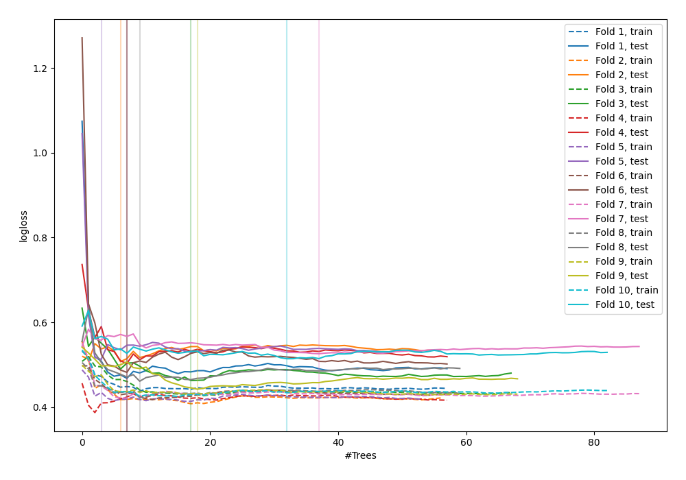

# Summary of 10_Default_ExtraTrees

[<< Go back](../README.md)

## Extra Trees Classifier (Extra Trees)
- **n_jobs**: -1
- **criterion**: gini
- **max_features**: 0.9
- **min_samples_split**: 30
- **max_depth**: 4
- **explain_level**: 0

## Validation
 - **validation_type**: kfold
 - **shuffle**: True
 - **stratify**: True
 - **k_folds**: 10

## Optimized metric
logloss

## Training time

5.4 seconds

## Metric details
|           |    score |   threshold |
|:----------|---------:|------------:|
| logloss   | 0.488188 | nan         |
| auc       | 0.891206 | nan         |
| f1        | 0.836735 |   0.486828  |
| accuracy  | 0.825455 |   0.486828  |
| precision | 1        |   0.821883  |
| recall    | 1        |   0.0923214 |
| mcc       | 0.651272 |   0.501146  |

## Confusion matrix (at threshold=0.486828)
|                     |   Predicted as negative |   Predicted as positive |
|:--------------------|------------------------:|------------------------:|
| Labeled as negative |                     104 |                      22 |
| Labeled as positive |                      26 |                     123 |

## Learning curves

[<< Go back](../README.md)
