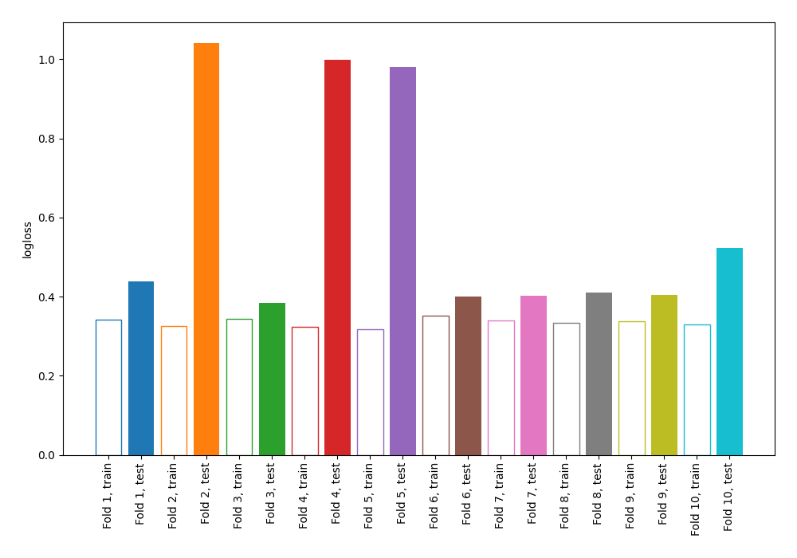

# Summary of 11_Default_NearestNeighbors

[<< Go back](../README.md)

## k-Nearest Neighbors (Nearest Neighbors)
- **n_jobs**: -1
- **n_neighbors**: 5
- **weights**: uniform
- **explain_level**: 0

## Validation
 - **validation_type**: kfold
 - **shuffle**: True
 - **stratify**: True
 - **k_folds**: 10

## Optimized metric
logloss

## Training time

0.7 seconds

## Metric details
|           |    score |   threshold |
|:----------|---------:|------------:|
| logloss   | 0.601604 |       nan   |
| auc       | 0.829978 |       nan   |
| f1        | 0.785515 |         0.2 |
| accuracy  | 0.752727 |         0.4 |
| precision | 0.870968 |         0.6 |
| recall    | 1        |         0   |
| mcc       | 0.501414 |         0.4 |

## Confusion matrix (at threshold=0.4)
|                     |   Predicted as negative |   Predicted as positive |
|:--------------------|------------------------:|------------------------:|
| Labeled as negative |                      91 |                      35 |
| Labeled as positive |                      33 |                     116 |

## Learning curves

[<< Go back](../README.md)
