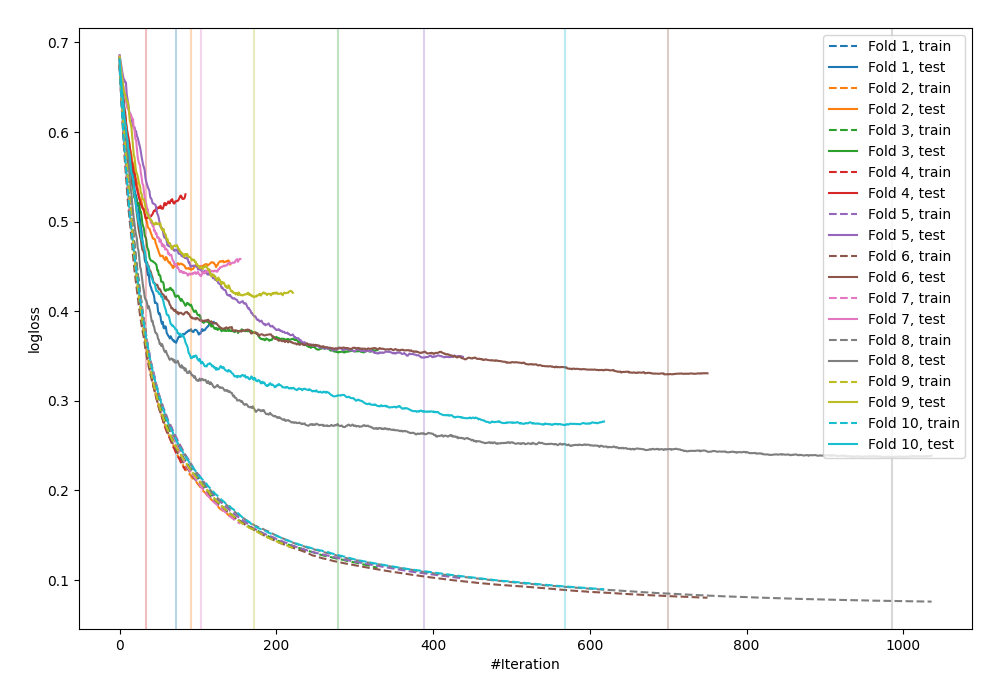

# Summary of 12_Xgboost

[<< Go back](../README.md)

## Extreme Gradient Boosting (Xgboost)
- **n_jobs**: -1
- **objective**: binary:logistic
- **eval_metric**: logloss
- **eta**: 0.05
- **max_depth**: 8
- **min_child_weight**: 5
- **subsample**: 1.0
- **colsample_bytree**: 1.0
- **explain_level**: 0

## Validation
 - **validation_type**: kfold
 - **shuffle**: True
 - **stratify**: True
 - **k_folds**: 10

## Optimized metric
logloss

## Training time

3.9 seconds

## Metric details
|           |    score |    threshold |
|:----------|---------:|-------------:|
| logloss   | 0.371756 | nan          |
| auc       | 0.918797 | nan          |
| f1        | 0.857143 |   0.5154     |
| accuracy  | 0.854545 |   0.597043   |
| precision | 1        |   0.966218   |
| recall    | 1        |   0.00555126 |
| mcc       | 0.718146 |   0.597043   |

## Confusion matrix (at threshold=0.597043)
|                     |   Predicted as negative |   Predicted as positive |
|:--------------------|------------------------:|------------------------:|
| Labeled as negative |                     116 |                      10 |
| Labeled as positive |                      30 |                     119 |

## Learning curves

[<< Go back](../README.md)
