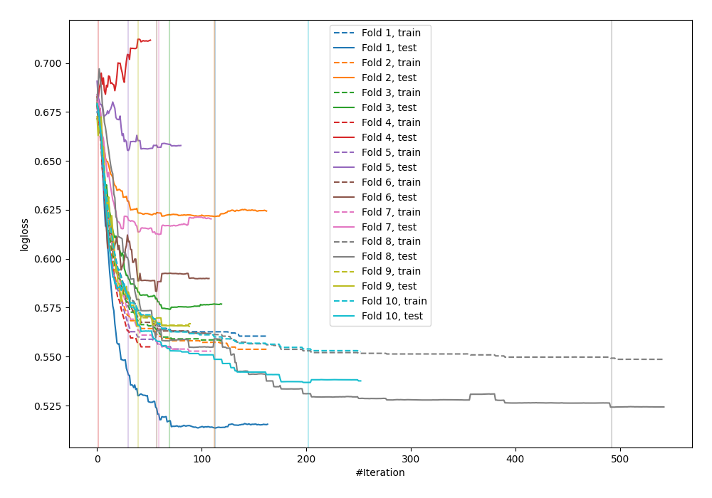

# Summary of 14_Xgboost

[<< Go back](../README.md)

## Extreme Gradient Boosting (Xgboost)
- **n_jobs**: -1
- **objective**: binary:logistic
- **eval_metric**: logloss
- **eta**: 0.1
- **max_depth**: 7
- **min_child_weight**: 25
- **subsample**: 0.9
- **colsample_bytree**: 0.6
- **explain_level**: 0

## Validation
 - **validation_type**: kfold
 - **shuffle**: True
 - **stratify**: True
 - **k_folds**: 10

## Optimized metric
logloss

## Training time

1.7 seconds

## Metric details
|           |    score |   threshold |
|:----------|---------:|------------:|
| logloss   | 0.587233 |  nan        |
| auc       | 0.768376 |  nan        |
| f1        | 0.737127 |    0.389587 |
| accuracy  | 0.72     |    0.610925 |
| precision | 1        |    0.777642 |
| recall    | 1        |    0.161612 |
| mcc       | 0.48615  |    0.610925 |

## Confusion matrix (at threshold=0.610925)
|                     |   Predicted as negative |   Predicted as positive |
|:--------------------|------------------------:|------------------------:|
| Labeled as negative |                     113 |                      13 |
| Labeled as positive |                      64 |                      85 |

## Learning curves

[<< Go back](../README.md)
