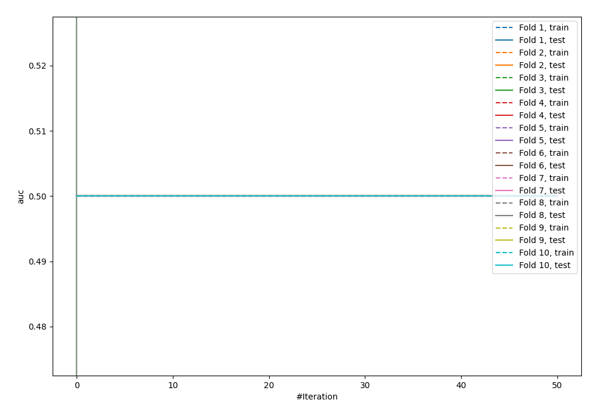

# Summary of 15_Xgboost

[<< Go back](../README.md)

## Extreme Gradient Boosting (Xgboost)
- **n_jobs**: -1
- **objective**: binary:logistic
- **eval_metric**: auc
- **eta**: 0.15
- **max_depth**: 8
- **min_child_weight**: 25
- **subsample**: 0.6
- **colsample_bytree**: 0.6
- **explain_level**: 0

## Validation
 - **validation_type**: kfold
 - **shuffle**: True
 - **stratify**: True
 - **k_folds**: 10

## Optimized metric
logloss

## Training time

17.9 seconds

## Metric details
|           |      score |   threshold |
|:----------|-----------:|------------:|
| logloss   | 0.691872   |  nan        |
| auc       | 0.498429   |  nan        |
| f1        | 0.70283    |    0.454219 |
| accuracy  | 0.541818   |    0.454219 |
| precision | 0.555556   |    0.511717 |
| recall    | 1          |    0.454219 |
| mcc       | 0.00909733 |    0.511717 |

## Confusion matrix (at threshold=0.454219)
|                     |   Predicted as negative |   Predicted as positive |
|:--------------------|------------------------:|------------------------:|
| Labeled as negative |                       0 |                     126 |
| Labeled as positive |                       0 |                     149 |

## Learning curves

[<< Go back](../README.md)
