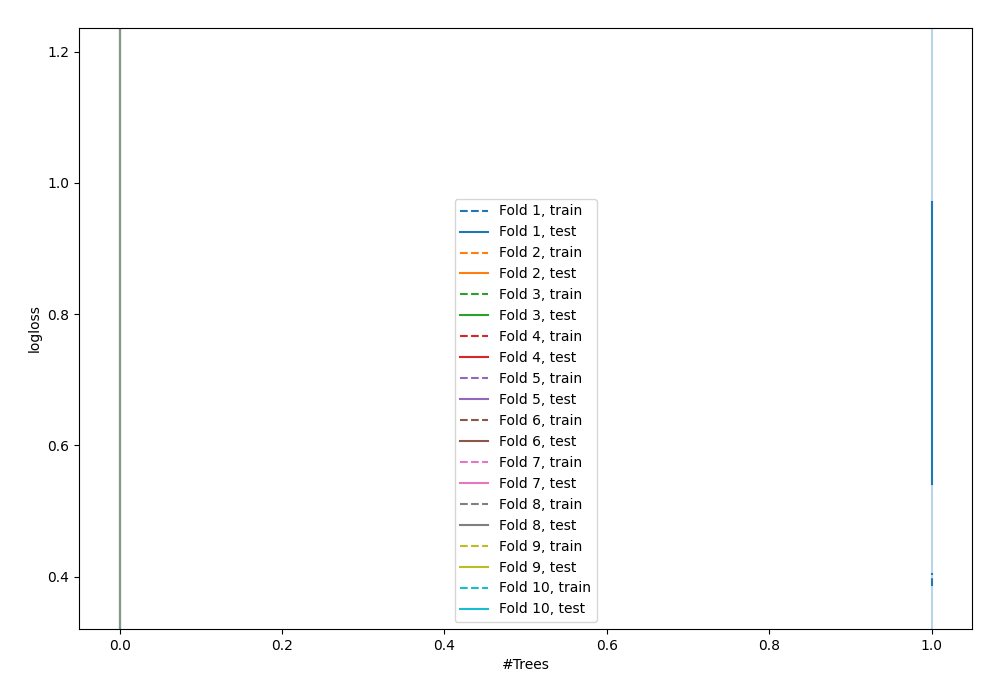

# Summary of 1_DecisionTree

[<< Go back](../README.md)

## Decision Tree
- **n_jobs**: -1
- **criterion**: gini
- **max_depth**: 3
- **explain_level**: 0

## Validation
 - **validation_type**: kfold
 - **shuffle**: True
 - **stratify**: True
 - **k_folds**: 10

## Optimized metric
logloss

## Training time

0.8 seconds

## Metric details
|           |    score |   threshold |
|:----------|---------:|------------:|
| logloss   | 0.782575 |  nan        |
| auc       | 0.756791 |  nan        |
| f1        | 0.746082 |    0.272727 |
| accuracy  | 0.730909 |    0.536044 |
| precision | 0.836957 |    0.833333 |
| recall    | 0.979866 |    0        |
| mcc       | 0.466439 |    0.536044 |

## Confusion matrix (at threshold=0.536044)
|                     |   Predicted as negative |   Predicted as positive |
|:--------------------|------------------------:|------------------------:|
| Labeled as negative |                      97 |                      29 |
| Labeled as positive |                      45 |                     104 |

## Learning curves

[<< Go back](../README.md)
