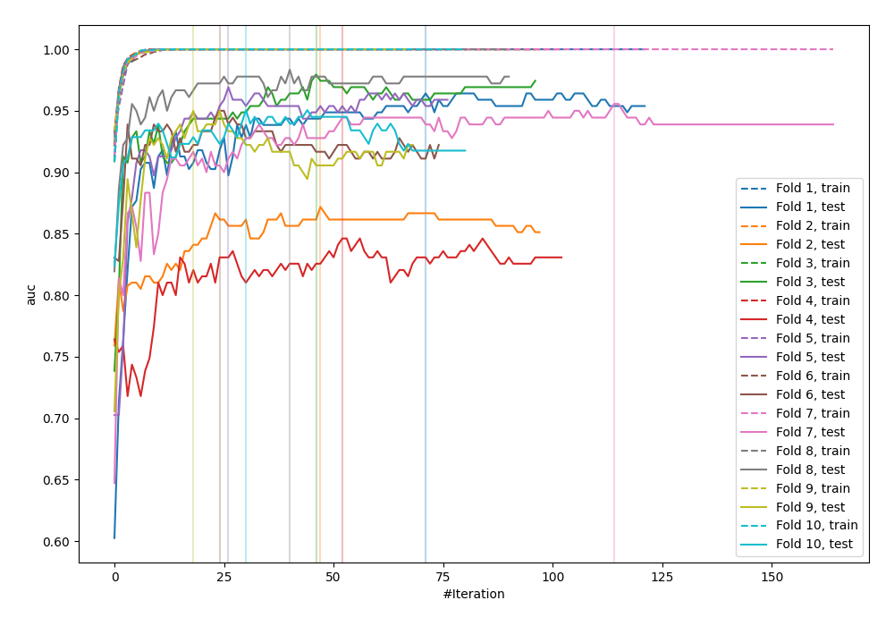

# Summary of 24_LightGBM

[<< Go back](../README.md)

## LightGBM
- **n_jobs**: -1
- **objective**: binary
- **metric**: auc
- **num_leaves**: 31
- **learning_rate**: 0.2
- **feature_fraction**: 0.5
- **bagging_fraction**: 0.8
- **min_data_in_leaf**: 10
- **explain_level**: 0

## Validation
 - **validation_type**: kfold
 - **shuffle**: True
 - **stratify**: True
 - **k_folds**: 10

## Optimized metric
logloss

## Training time

1.3 seconds

## Metric details
|           |    score |     threshold |
|:----------|---------:|--------------:|
| logloss   | 0.370315 | nan           |
| auc       | 0.928678 | nan           |
| f1        | 0.895623 |   0.480552    |
| accuracy  | 0.887273 |   0.480552    |
| precision | 1        |   0.999744    |
| recall    | 1        |   2.72207e-06 |
| mcc       | 0.773117 |   0.480552    |

## Confusion matrix (at threshold=0.480552)
|                     |   Predicted as negative |   Predicted as positive |
|:--------------------|------------------------:|------------------------:|
| Labeled as negative |                     111 |                      15 |
| Labeled as positive |                      16 |                     133 |

## Learning curves

[<< Go back](../README.md)
