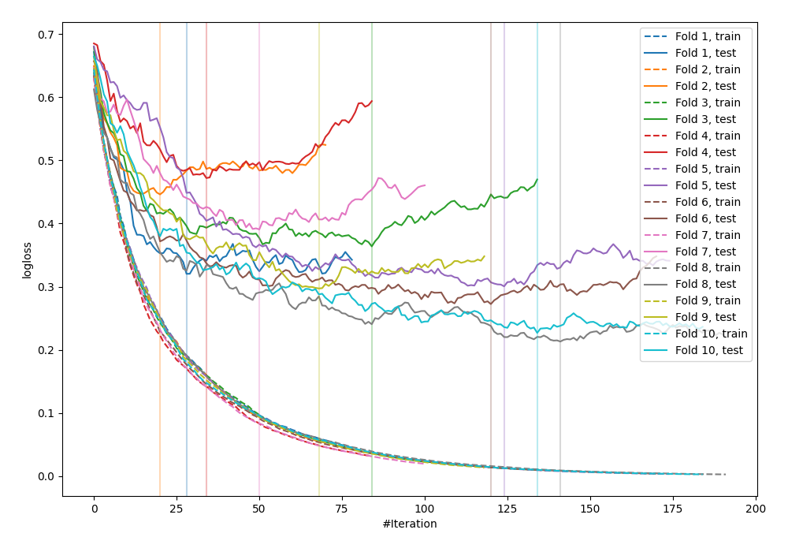

# Summary of 25_LightGBM

[<< Go back](../README.md)

## LightGBM
- **n_jobs**: -1
- **objective**: binary
- **metric**: binary_logloss
- **num_leaves**: 63
- **learning_rate**: 0.2
- **feature_fraction**: 0.5
- **bagging_fraction**: 1.0
- **min_data_in_leaf**: 30
- **explain_level**: 0

## Validation
 - **validation_type**: kfold
 - **shuffle**: True
 - **stratify**: True
 - **k_folds**: 10

## Optimized metric
logloss

## Training time

1.1 seconds

## Metric details
|           |    score |    threshold |
|:----------|---------:|-------------:|
| logloss   | 0.331209 | nan          |
| auc       | 0.93198  | nan          |
| f1        | 0.879725 |   0.552781   |
| accuracy  | 0.872727 |   0.552781   |
| precision | 1        |   0.992371   |
| recall    | 1        |   0.00166591 |
| mcc       | 0.745728 |   0.552781   |

## Confusion matrix (at threshold=0.552781)
|                     |   Predicted as negative |   Predicted as positive |
|:--------------------|------------------------:|------------------------:|
| Labeled as negative |                     112 |                      14 |
| Labeled as positive |                      21 |                     128 |

## Learning curves

[<< Go back](../README.md)
