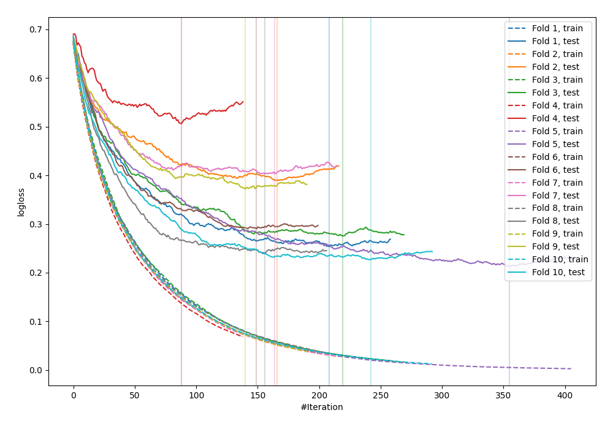

# Summary of 26_LightGBM

[<< Go back](../README.md)

## LightGBM
- **n_jobs**: -1
- **objective**: binary
- **metric**: binary_logloss
- **num_leaves**: 127
- **learning_rate**: 0.05
- **feature_fraction**: 0.5
- **bagging_fraction**: 0.5
- **min_data_in_leaf**: 20
- **explain_level**: 0

## Validation
 - **validation_type**: kfold
 - **shuffle**: True
 - **stratify**: True
 - **k_folds**: 10

## Optimized metric
logloss

## Training time

2.1 seconds

## Metric details
|           |    score |     threshold |
|:----------|---------:|--------------:|
| logloss   | 0.317197 | nan           |
| auc       | 0.937467 | nan           |
| f1        | 0.879195 |   0.489485    |
| accuracy  | 0.872727 |   0.616536    |
| precision | 1        |   0.986313    |
| recall    | 1        |   0.000716507 |
| mcc       | 0.750455 |   0.616536    |

## Confusion matrix (at threshold=0.616536)
|                     |   Predicted as negative |   Predicted as positive |
|:--------------------|------------------------:|------------------------:|
| Labeled as negative |                     116 |                      10 |
| Labeled as positive |                      25 |                     124 |

## Learning curves

[<< Go back](../README.md)
