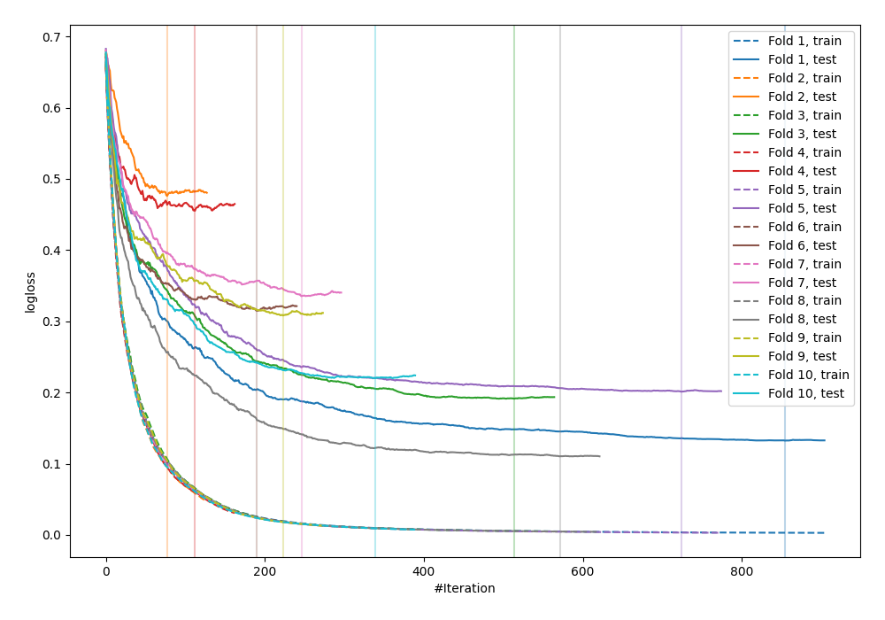

# Summary of 30_CatBoost

[<< Go back](../README.md)

## CatBoost
- **n_jobs**: -1
- **learning_rate**: 0.05
- **depth**: 8
- **rsm**: 0.8
- **loss_function**: Logloss
- **explain_level**: 0

## Validation
 - **validation_type**: kfold
 - **shuffle**: True
 - **stratify**: True
 - **k_folds**: 10

## Optimized metric
logloss

## Training time

36.3 seconds

## Metric details
|           |    score |   threshold |
|:----------|---------:|------------:|
| logloss   | 0.274779 | nan         |
| auc       | 0.954618 | nan         |
| f1        | 0.903654 |   0.498961  |
| accuracy  | 0.894545 |   0.498961  |
| precision | 1        |   0.962972  |
| recall    | 1        |   0.0025126 |
| mcc       | 0.787405 |   0.498961  |

## Confusion matrix (at threshold=0.498961)
|                     |   Predicted as negative |   Predicted as positive |
|:--------------------|------------------------:|------------------------:|
| Labeled as negative |                     110 |                      16 |
| Labeled as positive |                      13 |                     136 |

## Learning curves

[<< Go back](../README.md)
