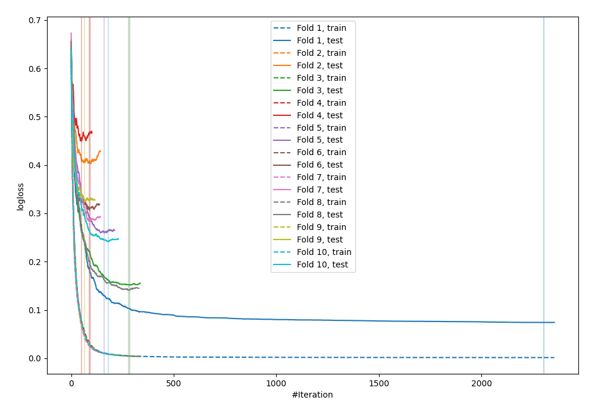

# Summary of 31_CatBoost

[<< Go back](../README.md)

## CatBoost
- **n_jobs**: -1
- **learning_rate**: 0.1
- **depth**: 8
- **rsm**: 1.0
- **loss_function**: Logloss
- **explain_level**: 0

## Validation
 - **validation_type**: kfold
 - **shuffle**: True
 - **stratify**: True
 - **k_folds**: 10

## Optimized metric
logloss

## Training time

41.7 seconds

## Metric details
|           |    score |    threshold |
|:----------|---------:|-------------:|
| logloss   | 0.263467 | nan          |
| auc       | 0.958826 | nan          |
| f1        | 0.908517 |   0.335571   |
| accuracy  | 0.898182 |   0.481158   |
| precision | 1        |   0.991826   |
| recall    | 1        |   0.00107401 |
| mcc       | 0.79577  |   0.51524    |

## Confusion matrix (at threshold=0.481158)
|                     |   Predicted as negative |   Predicted as positive |
|:--------------------|------------------------:|------------------------:|
| Labeled as negative |                     113 |                      13 |
| Labeled as positive |                      15 |                     134 |

## Learning curves

[<< Go back](../README.md)
