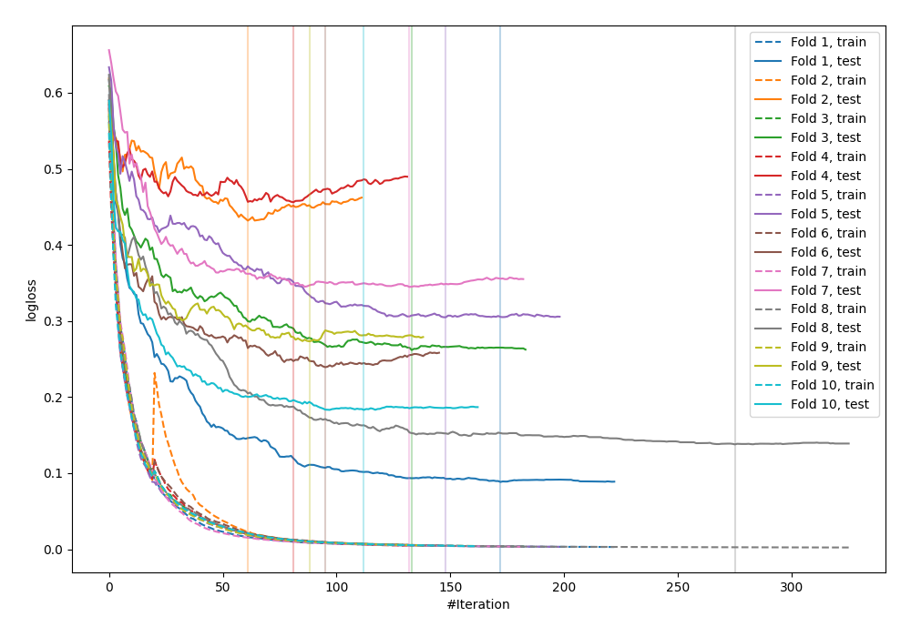

# Summary of 33_CatBoost

[<< Go back](../README.md)

## CatBoost
- **n_jobs**: -1
- **learning_rate**: 0.2
- **depth**: 8
- **rsm**: 1.0
- **loss_function**: Logloss
- **explain_level**: 0

## Validation
 - **validation_type**: kfold
 - **shuffle**: True
 - **stratify**: True
 - **k_folds**: 10

## Optimized metric
logloss

## Training time

19.3 seconds

## Metric details
|           |    score |    threshold |
|:----------|---------:|-------------:|
| logloss   | 0.272841 | nan          |
| auc       | 0.952328 | nan          |
| f1        | 0.909091 |   0.448022   |
| accuracy  | 0.898182 |   0.448022   |
| precision | 1        |   0.997262   |
| recall    | 1        |   0.00166674 |
| mcc       | 0.795829 |   0.448022   |

## Confusion matrix (at threshold=0.448022)
|                     |   Predicted as negative |   Predicted as positive |
|:--------------------|------------------------:|------------------------:|
| Labeled as negative |                     107 |                      19 |
| Labeled as positive |                       9 |                     140 |

## Learning curves

[<< Go back](../README.md)
