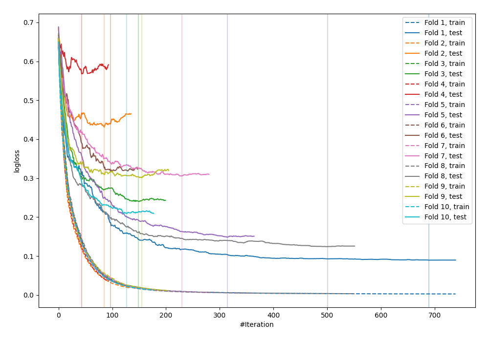

# Summary of 34_CatBoost

[<< Go back](../README.md)

## CatBoost
- **n_jobs**: -1
- **learning_rate**: 0.1
- **depth**: 6
- **rsm**: 0.7
- **loss_function**: Logloss
- **explain_level**: 0

## Validation
 - **validation_type**: kfold
 - **shuffle**: True
 - **stratify**: True
 - **k_folds**: 10

## Optimized metric
logloss

## Training time

8.6 seconds

## Metric details
|           |    score |     threshold |
|:----------|---------:|--------------:|
| logloss   | 0.273692 | nan           |
| auc       | 0.953872 | nan           |
| f1        | 0.896104 |   0.43619     |
| accuracy  | 0.883636 |   0.43619     |
| precision | 1        |   0.975217    |
| recall    | 1        |   0.000959563 |
| mcc       | 0.780834 |   0.754662    |

## Confusion matrix (at threshold=0.43619)
|                     |   Predicted as negative |   Predicted as positive |
|:--------------------|------------------------:|------------------------:|
| Labeled as negative |                     105 |                      21 |
| Labeled as positive |                      11 |                     138 |

## Learning curves

[<< Go back](../README.md)
