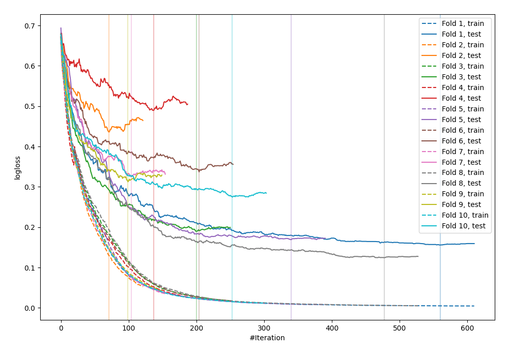

# Summary of 35_CatBoost

[<< Go back](../README.md)

## CatBoost
- **n_jobs**: -1
- **learning_rate**: 0.1
- **depth**: 4
- **rsm**: 0.7
- **loss_function**: Logloss
- **explain_level**: 0

## Validation
 - **validation_type**: kfold
 - **shuffle**: True
 - **stratify**: True
 - **k_folds**: 10

## Optimized metric
logloss

## Training time

4.5 seconds

## Metric details
|           |    score |    threshold |
|:----------|---------:|-------------:|
| logloss   | 0.281628 | nan          |
| auc       | 0.951103 | nan          |
| f1        | 0.909091 |   0.563083   |
| accuracy  | 0.901818 |   0.563083   |
| precision | 1        |   0.997351   |
| recall    | 1        |   0.00213058 |
| mcc       | 0.802396 |   0.563083   |

## Confusion matrix (at threshold=0.563083)
|                     |   Predicted as negative |   Predicted as positive |
|:--------------------|------------------------:|------------------------:|
| Labeled as negative |                     113 |                      13 |
| Labeled as positive |                      14 |                     135 |

## Learning curves

[<< Go back](../README.md)
