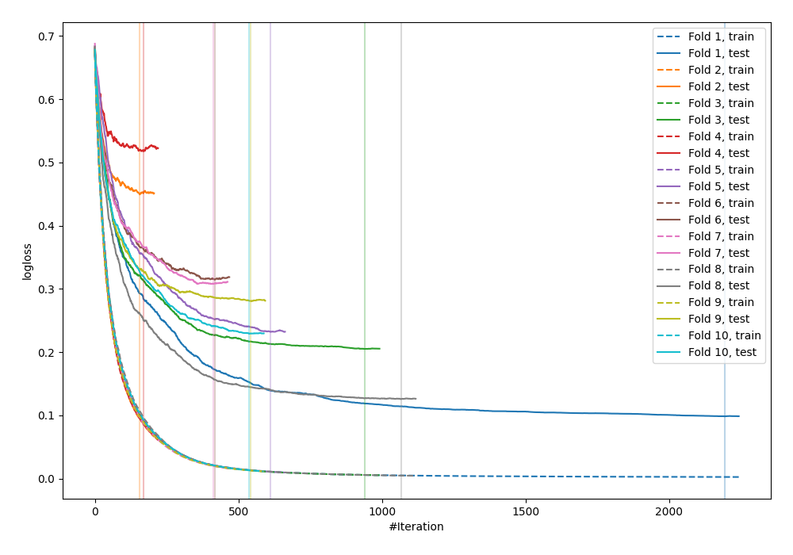

# Summary of 36_CatBoost

[<< Go back](../README.md)

## CatBoost
- **n_jobs**: -1
- **learning_rate**: 0.025
- **depth**: 8
- **rsm**: 1.0
- **loss_function**: Logloss
- **explain_level**: 0

## Validation
 - **validation_type**: kfold
 - **shuffle**: True
 - **stratify**: True
 - **k_folds**: 10

## Optimized metric
logloss

## Training time

78.4 seconds

## Metric details
|           |    score |    threshold |
|:----------|---------:|-------------:|
| logloss   | 0.276533 | nan          |
| auc       | 0.954991 | nan          |
| f1        | 0.895105 |   0.639886   |
| accuracy  | 0.890909 |   0.639886   |
| precision | 1        |   0.947127   |
| recall    | 1        |   0.00127043 |
| mcc       | 0.784877 |   0.639886   |

## Confusion matrix (at threshold=0.639886)
|                     |   Predicted as negative |   Predicted as positive |
|:--------------------|------------------------:|------------------------:|
| Labeled as negative |                     117 |                       9 |
| Labeled as positive |                      21 |                     128 |

## Learning curves

[<< Go back](../README.md)
