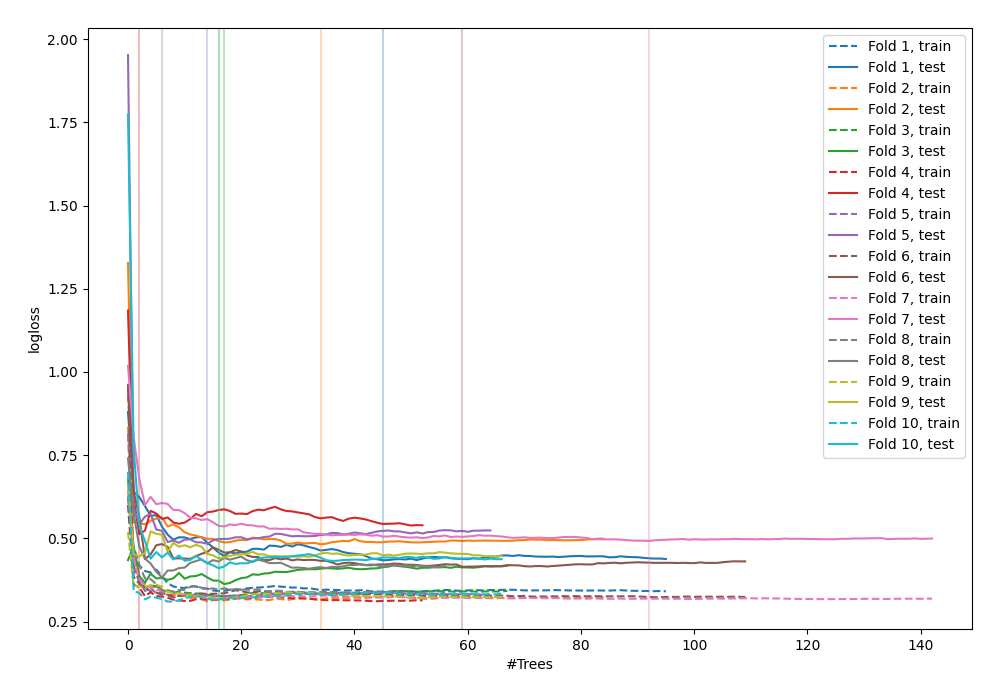

# Summary of 39_RandomForest

[<< Go back](../README.md)

## Random Forest
- **n_jobs**: -1
- **criterion**: gini
- **max_features**: 0.5
- **min_samples_split**: 20
- **max_depth**: 4
- **explain_level**: 0

## Validation
 - **validation_type**: kfold
 - **shuffle**: True
 - **stratify**: True
 - **k_folds**: 10

## Optimized metric
logloss

## Training time

6.7 seconds

## Metric details
|           |    score |   threshold |
|:----------|---------:|------------:|
| logloss   | 0.441948 | nan         |
| auc       | 0.910967 | nan         |
| f1        | 0.856164 |   0.534248  |
| accuracy  | 0.850909 |   0.593883  |
| precision | 1        |   0.865245  |
| recall    | 1        |   0.0775947 |
| mcc       | 0.715985 |   0.593883  |

## Confusion matrix (at threshold=0.593883)
|                     |   Predicted as negative |   Predicted as positive |
|:--------------------|------------------------:|------------------------:|
| Labeled as negative |                     118 |                       8 |
| Labeled as positive |                      33 |                     116 |

## Learning curves

[<< Go back](../README.md)
