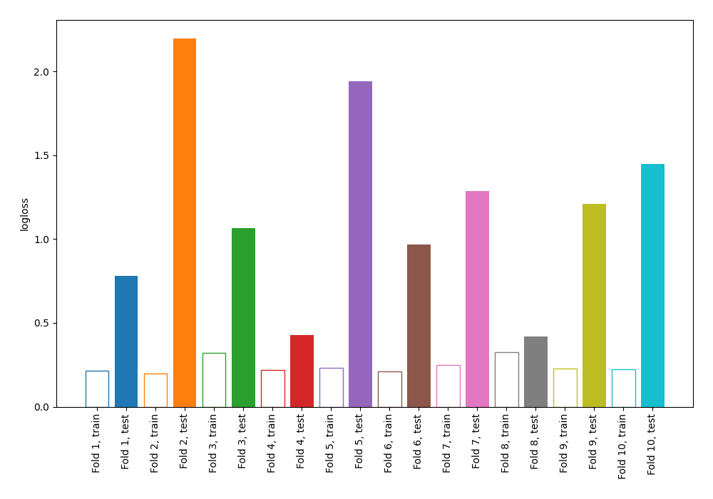

# Summary of 3_DecisionTree

[<< Go back](../README.md)

## Decision Tree
- **n_jobs**: -1
- **criterion**: gini
- **max_depth**: 4
- **explain_level**: 0

## Validation
 - **validation_type**: kfold
 - **shuffle**: True
 - **stratify**: True
 - **k_folds**: 10

## Optimized metric
logloss

## Training time

0.5 seconds

## Metric details
|           |    score |   threshold |
|:----------|---------:|------------:|
| logloss   | 1.17593  |  nan        |
| auc       | 0.809231 |  nan        |
| f1        | 0.788462 |    0.303571 |
| accuracy  | 0.774545 |    0.625    |
| precision | 0.831933 |    0.818182 |
| recall    | 0.932886 |    0        |
| mcc       | 0.549063 |    0.625    |

## Confusion matrix (at threshold=0.625)
|                     |   Predicted as negative |   Predicted as positive |
|:--------------------|------------------------:|------------------------:|
| Labeled as negative |                      99 |                      27 |
| Labeled as positive |                      35 |                     114 |

## Learning curves

[<< Go back](../README.md)
