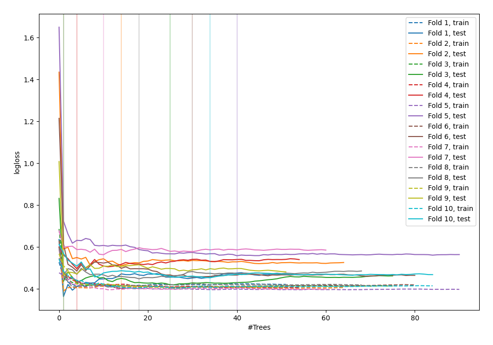

# Summary of 41_RandomForest

[<< Go back](../README.md)

## Random Forest
- **n_jobs**: -1
- **criterion**: gini
- **max_features**: 0.8
- **min_samples_split**: 40
- **max_depth**: 3
- **explain_level**: 0

## Validation
 - **validation_type**: kfold
 - **shuffle**: True
 - **stratify**: True
 - **k_folds**: 10

## Optimized metric
logloss

## Training time

5.7 seconds

## Metric details
|           |    score |   threshold |
|:----------|---------:|------------:|
| logloss   | 0.473459 |  nan        |
| auc       | 0.866864 |  nan        |
| f1        | 0.802548 |    0.451436 |
| accuracy  | 0.778182 |    0.511552 |
| precision | 1        |    0.827748 |
| recall    | 1        |    0.105502 |
| mcc       | 0.575907 |    0.619116 |

## Confusion matrix (at threshold=0.511552)
|                     |   Predicted as negative |   Predicted as positive |
|:--------------------|------------------------:|------------------------:|
| Labeled as negative |                     100 |                      26 |
| Labeled as positive |                      35 |                     114 |

## Learning curves

[<< Go back](../README.md)
