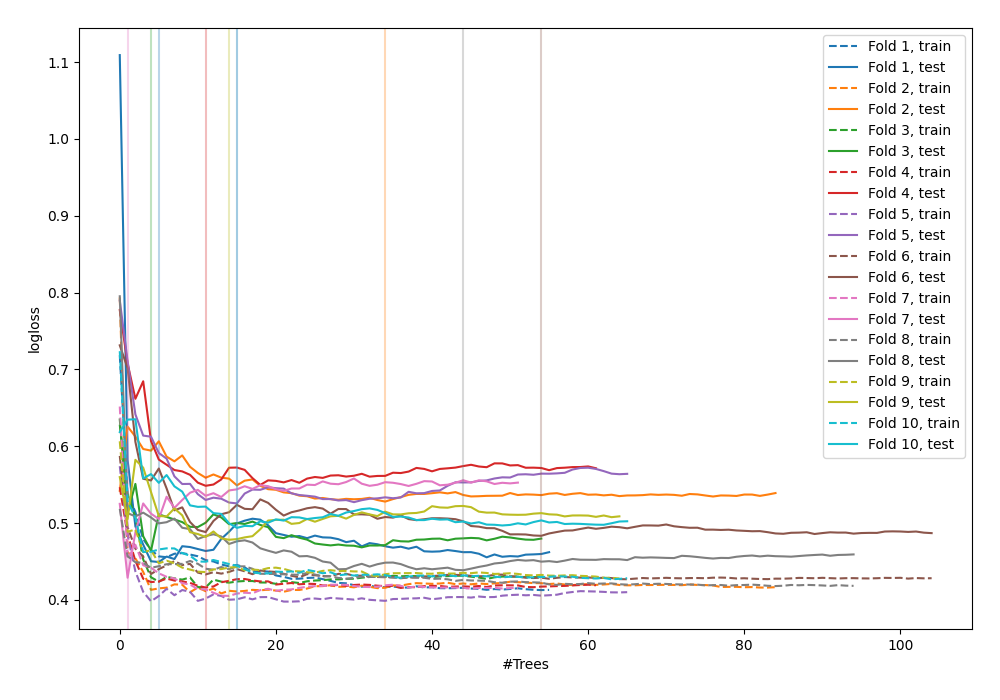

# Summary of 42_RandomForest

[<< Go back](../README.md)

## Random Forest
- **n_jobs**: -1
- **criterion**: entropy
- **max_features**: 0.6
- **min_samples_split**: 50
- **max_depth**: 6
- **explain_level**: 0

## Validation
 - **validation_type**: kfold
 - **shuffle**: True
 - **stratify**: True
 - **k_folds**: 10

## Optimized metric
logloss

## Training time

5.9 seconds

## Metric details
|           |    score |   threshold |
|:----------|---------:|------------:|
| logloss   | 0.484128 | nan         |
| auc       | 0.886785 | nan         |
| f1        | 0.812865 |   0.41423   |
| accuracy  | 0.8      |   0.536844  |
| precision | 1        |   0.794845  |
| recall    | 1        |   0.0209416 |
| mcc       | 0.603061 |   0.536844  |

## Confusion matrix (at threshold=0.536844)
|                     |   Predicted as negative |   Predicted as positive |
|:--------------------|------------------------:|------------------------:|
| Labeled as negative |                     105 |                      21 |
| Labeled as positive |                      34 |                     115 |

## Learning curves

[<< Go back](../README.md)
