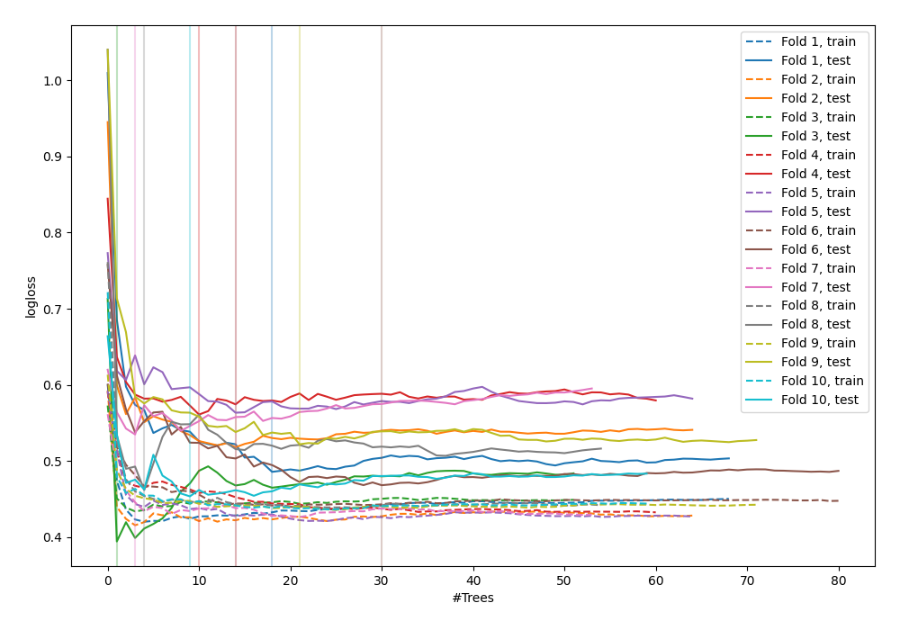

# Summary of 43_RandomForest

[<< Go back](../README.md)

## Random Forest
- **n_jobs**: -1
- **criterion**: gini
- **max_features**: 0.7
- **min_samples_split**: 50
- **max_depth**: 3
- **explain_level**: 0

## Validation
 - **validation_type**: kfold
 - **shuffle**: True
 - **stratify**: True
 - **k_folds**: 10

## Optimized metric
logloss

## Training time

5.4 seconds

## Metric details
|           |    score |   threshold |
|:----------|---------:|------------:|
| logloss   | 0.496474 | nan         |
| auc       | 0.863002 | nan         |
| f1        | 0.81388  |   0.470635  |
| accuracy  | 0.792727 |   0.491449  |
| precision | 1        |   0.914746  |
| recall    | 1        |   0.0592105 |
| mcc       | 0.582294 |   0.491449  |

## Confusion matrix (at threshold=0.491449)
|                     |   Predicted as negative |   Predicted as positive |
|:--------------------|------------------------:|------------------------:|
| Labeled as negative |                      97 |                      29 |
| Labeled as positive |                      28 |                     121 |

## Learning curves

[<< Go back](../README.md)
