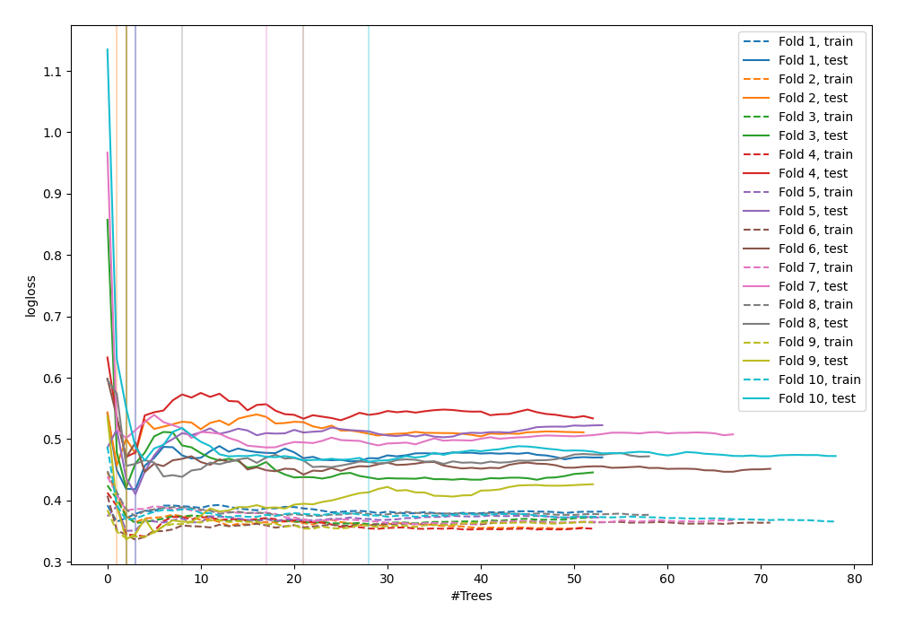

# Summary of 49_ExtraTrees

[<< Go back](../README.md)

## Extra Trees Classifier (Extra Trees)
- **n_jobs**: -1
- **criterion**: gini
- **max_features**: 0.7
- **min_samples_split**: 30
- **max_depth**: 7
- **explain_level**: 0

## Validation
 - **validation_type**: kfold
 - **shuffle**: True
 - **stratify**: True
 - **k_folds**: 10

## Optimized metric
logloss

## Training time

4.7 seconds

## Metric details
|           |    score |   threshold |
|:----------|---------:|------------:|
| logloss   | 0.434427 | nan         |
| auc       | 0.92937  | nan         |
| f1        | 0.882155 |   0.507403  |
| accuracy  | 0.872727 |   0.507403  |
| precision | 1        |   0.866914  |
| recall    | 1        |   0.0571429 |
| mcc       | 0.747775 |   0.529768  |

## Confusion matrix (at threshold=0.507403)
|                     |   Predicted as negative |   Predicted as positive |
|:--------------------|------------------------:|------------------------:|
| Labeled as negative |                     109 |                      17 |
| Labeled as positive |                      18 |                     131 |

## Learning curves

[<< Go back](../README.md)
