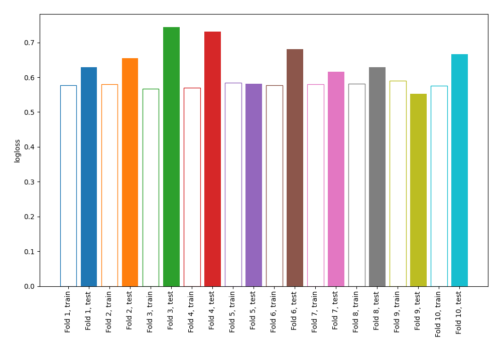

# Summary of 4_Linear

[<< Go back](../README.md)

## Logistic Regression (Linear)
- **n_jobs**: -1
- **explain_level**: 0

## Validation
 - **validation_type**: kfold
 - **shuffle**: True
 - **stratify**: True
 - **k_folds**: 10

## Optimized metric
logloss

## Training time

2.9 seconds

## Metric details
|           |    score |   threshold |
|:----------|---------:|------------:|
| logloss   | 0.649016 | nan         |
| auc       | 0.677533 | nan         |
| f1        | 0.728682 |   0.298206  |
| accuracy  | 0.650909 |   0.40525   |
| precision | 0.916667 |   0.865389  |
| recall    | 1        |   0.0524983 |
| mcc       | 0.299003 |   0.40525   |

## Confusion matrix (at threshold=0.40525)
|                     |   Predicted as negative |   Predicted as positive |
|:--------------------|------------------------:|------------------------:|
| Labeled as negative |                      51 |                      75 |
| Labeled as positive |                      21 |                     128 |

## Learning curves

[<< Go back](../README.md)
