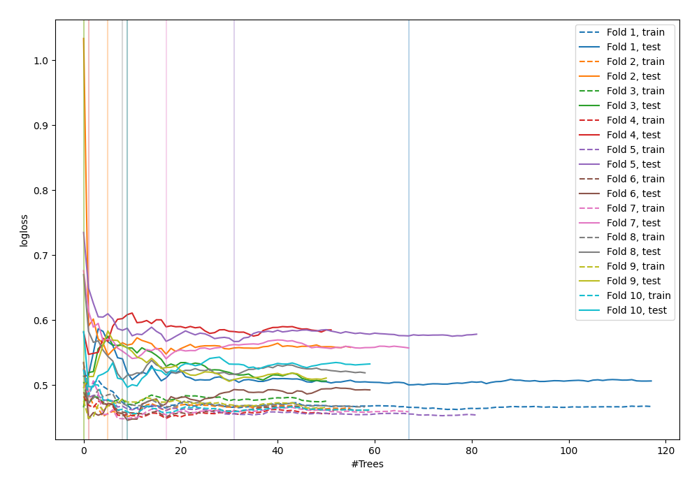

# Summary of 51_ExtraTrees

[<< Go back](../README.md)

## Extra Trees Classifier (Extra Trees)
- **n_jobs**: -1
- **criterion**: entropy
- **max_features**: 0.6
- **min_samples_split**: 50
- **max_depth**: 6
- **explain_level**: 0

## Validation
 - **validation_type**: kfold
 - **shuffle**: True
 - **stratify**: True
 - **k_folds**: 10

## Optimized metric
logloss

## Training time

5.1 seconds

## Metric details
|           |    score |   threshold |
|:----------|---------:|------------:|
| logloss   | 0.511953 |  nan        |
| auc       | 0.844386 |  nan        |
| f1        | 0.798611 |    0.492107 |
| accuracy  | 0.789091 |    0.492107 |
| precision | 1        |    0.912869 |
| recall    | 1        |    0        |
| mcc       | 0.58466  |    0.634744 |

## Confusion matrix (at threshold=0.492107)
|                     |   Predicted as negative |   Predicted as positive |
|:--------------------|------------------------:|------------------------:|
| Labeled as negative |                     102 |                      24 |
| Labeled as positive |                      34 |                     115 |

## Learning curves

[<< Go back](../README.md)
