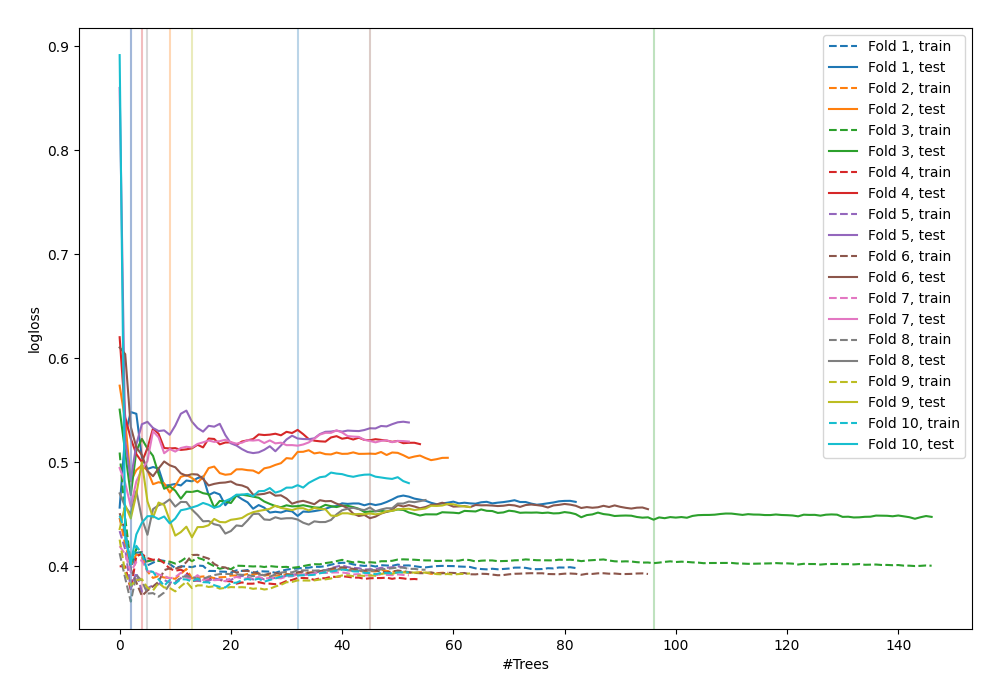

# Summary of 53_ExtraTrees

[<< Go back](../README.md)

## Extra Trees Classifier (Extra Trees)
- **n_jobs**: -1
- **criterion**: gini
- **max_features**: 1.0
- **min_samples_split**: 40
- **max_depth**: 7
- **explain_level**: 0

## Validation
 - **validation_type**: kfold
 - **shuffle**: True
 - **stratify**: True
 - **k_folds**: 10

## Optimized metric
logloss

## Training time

5.4 seconds

## Metric details
|           |    score |   threshold |
|:----------|---------:|------------:|
| logloss   | 0.451589 |  nan        |
| auc       | 0.904362 |  nan        |
| f1        | 0.85443  |    0.461937 |
| accuracy  | 0.832727 |    0.461937 |
| precision | 1        |    0.798259 |
| recall    | 1        |    0        |
| mcc       | 0.665279 |    0.461937 |

## Confusion matrix (at threshold=0.461937)
|                     |   Predicted as negative |   Predicted as positive |
|:--------------------|------------------------:|------------------------:|
| Labeled as negative |                      94 |                      32 |
| Labeled as positive |                      14 |                     135 |

## Learning curves

[<< Go back](../README.md)
