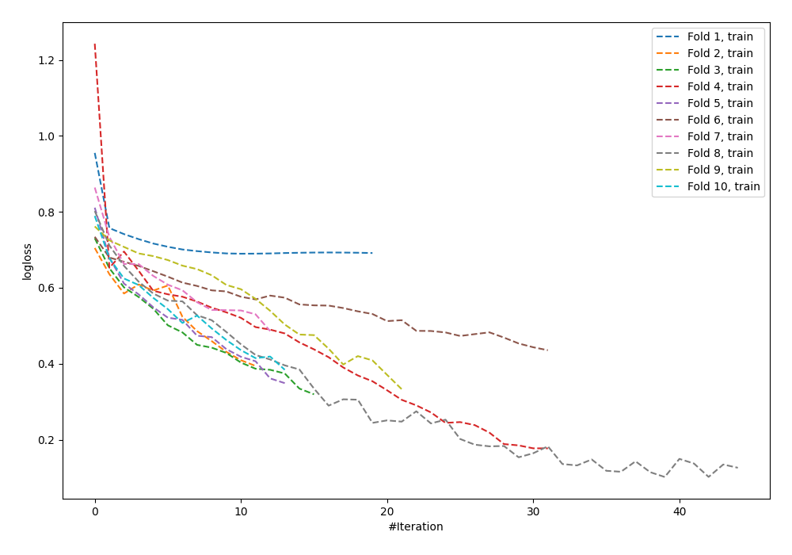

# Summary of 57_NeuralNetwork

[<< Go back](../README.md)

## Neural Network
- **n_jobs**: -1
- **dense_1_size**: 32
- **dense_2_size**: 4
- **learning_rate**: 0.05
- **explain_level**: 0

## Validation
 - **validation_type**: kfold
 - **shuffle**: True
 - **stratify**: True
 - **k_folds**: 10

## Optimized metric
logloss

## Training time

1.3 seconds

## Metric details
|           |    score |     threshold |
|:----------|---------:|--------------:|
| logloss   | 0.713123 | nan           |
| auc       | 0.649968 | nan           |
| f1        | 0.710875 |   0.367527    |
| accuracy  | 0.636364 |   0.475903    |
| precision | 1        |   0.988033    |
| recall    | 1        |   0.000265237 |
| mcc       | 0.261648 |   0.475903    |

## Confusion matrix (at threshold=0.475903)
|                     |   Predicted as negative |   Predicted as positive |
|:--------------------|------------------------:|------------------------:|
| Labeled as negative |                      55 |                      71 |
| Labeled as positive |                      29 |                     120 |

## Learning curves

[<< Go back](../README.md)
