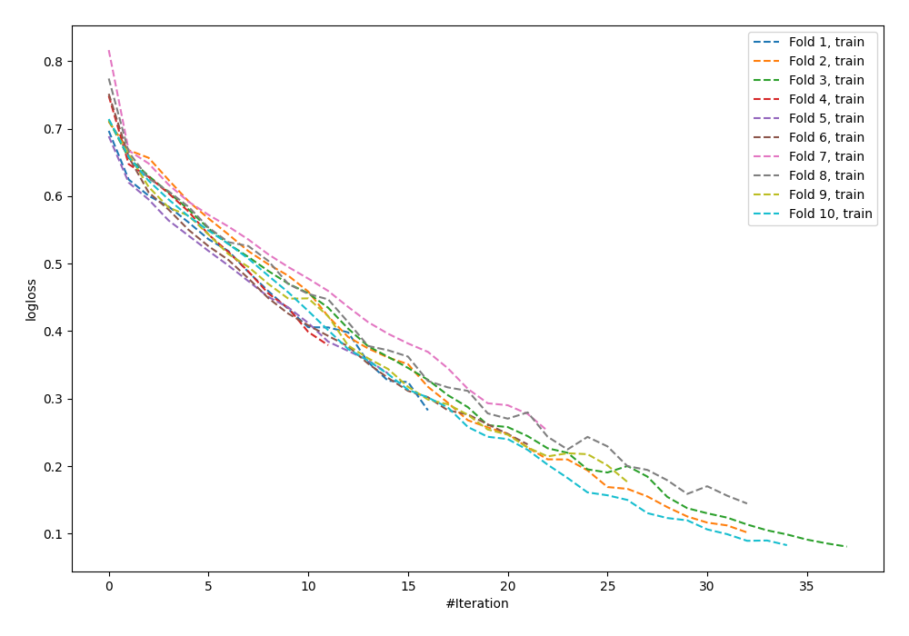

# Summary of 58_NeuralNetwork

[<< Go back](../README.md)

## Neural Network
- **n_jobs**: -1
- **dense_1_size**: 64
- **dense_2_size**: 16
- **learning_rate**: 0.01
- **explain_level**: 0

## Validation
 - **validation_type**: kfold
 - **shuffle**: True
 - **stratify**: True
 - **k_folds**: 10

## Optimized metric
logloss

## Training time

2.8 seconds

## Metric details
|           |    score |    threshold |
|:----------|---------:|-------------:|
| logloss   | 0.551554 | nan          |
| auc       | 0.800469 | nan          |
| f1        | 0.784431 |   0.396124   |
| accuracy  | 0.738182 |   0.396124   |
| precision | 0.897436 |   0.880471   |
| recall    | 1        |   0.00183016 |
| mcc       | 0.478503 |   0.396124   |

## Confusion matrix (at threshold=0.396124)
|                     |   Predicted as negative |   Predicted as positive |
|:--------------------|------------------------:|------------------------:|
| Labeled as negative |                      72 |                      54 |
| Labeled as positive |                      18 |                     131 |

## Learning curves

[<< Go back](../README.md)
