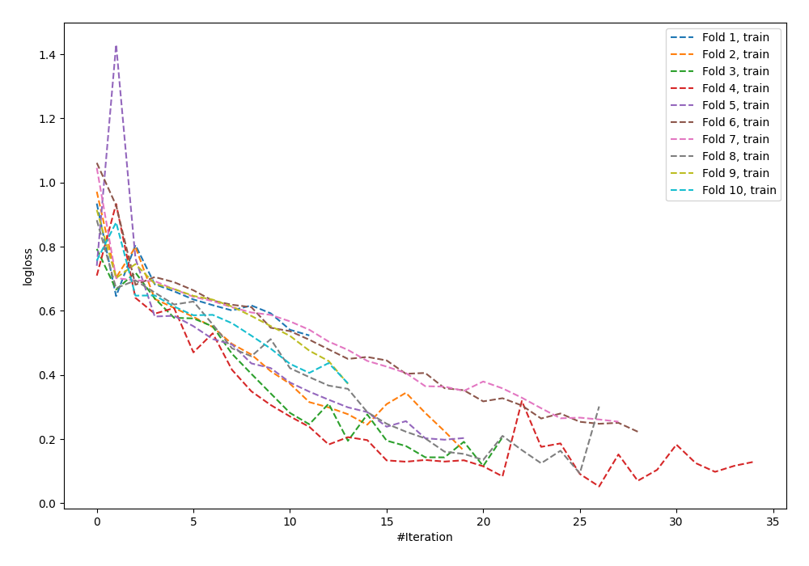

# Summary of 59_NeuralNetwork

[<< Go back](../README.md)

## Neural Network
- **n_jobs**: -1
- **dense_1_size**: 64
- **dense_2_size**: 32
- **learning_rate**: 0.08
- **explain_level**: 0

## Validation
 - **validation_type**: kfold
 - **shuffle**: True
 - **stratify**: True
 - **k_folds**: 10

## Optimized metric
logloss

## Training time

2.7 seconds

## Metric details
|           |    score |     threshold |
|:----------|---------:|--------------:|
| logloss   | 0.83599  | nan           |
| auc       | 0.731996 | nan           |
| f1        | 0.755952 |   0.45491     |
| accuracy  | 0.701818 |   0.462273    |
| precision | 1        |   1           |
| recall    | 1        |   7.57648e-07 |
| mcc       | 0.401779 |   0.45491     |

## Confusion matrix (at threshold=0.462273)
|                     |   Predicted as negative |   Predicted as positive |
|:--------------------|------------------------:|------------------------:|
| Labeled as negative |                      67 |                      59 |
| Labeled as positive |                      23 |                     126 |

## Learning curves

[<< Go back](../README.md)
