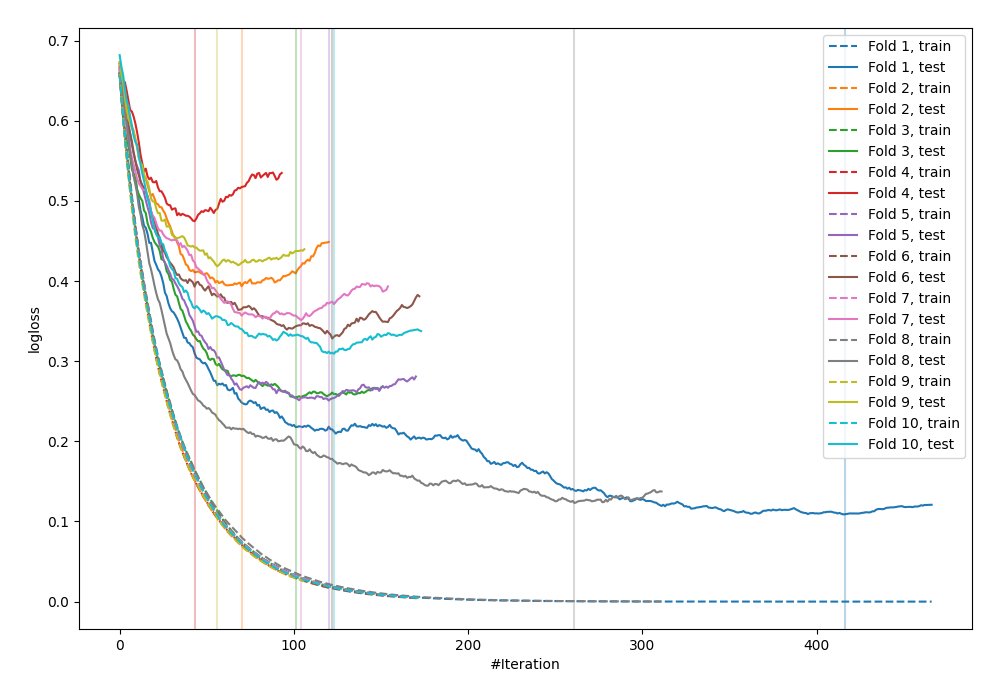

# Summary of 5_Default_LightGBM

[<< Go back](../README.md)

## LightGBM
- **n_jobs**: -1
- **objective**: binary
- **metric**: binary_logloss
- **num_leaves**: 63
- **learning_rate**: 0.05
- **feature_fraction**: 0.9
- **bagging_fraction**: 0.9
- **min_data_in_leaf**: 10
- **explain_level**: 0

## Validation
 - **validation_type**: kfold
 - **shuffle**: True
 - **stratify**: True
 - **k_folds**: 10

## Optimized metric
logloss

## Training time

1.9 seconds

## Metric details
|           |    score |     threshold |
|:----------|---------:|--------------:|
| logloss   | 0.301268 | nan           |
| auc       | 0.941728 | nan           |
| f1        | 0.898089 |   0.35366     |
| accuracy  | 0.883636 |   0.35366     |
| precision | 1        |   0.973644    |
| recall    | 1        |   2.02426e-05 |
| mcc       | 0.768716 |   0.35366     |

## Confusion matrix (at threshold=0.35366)
|                     |   Predicted as negative |   Predicted as positive |
|:--------------------|------------------------:|------------------------:|
| Labeled as negative |                     102 |                      24 |
| Labeled as positive |                       8 |                     141 |

## Learning curves

[<< Go back](../README.md)
