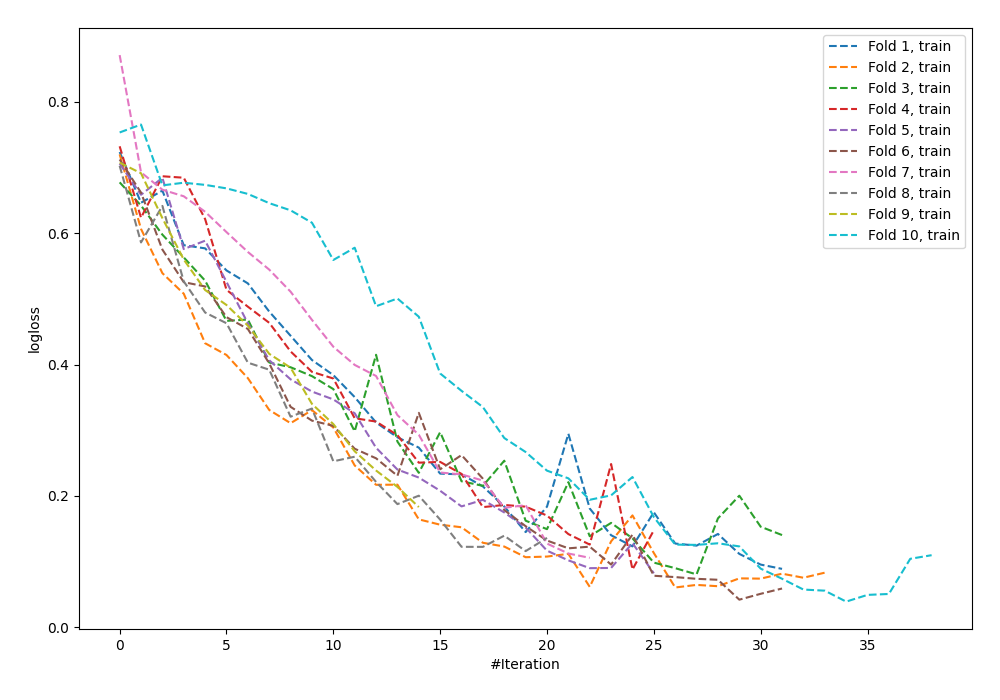

# Summary of 60_NeuralNetwork

[<< Go back](../README.md)

## Neural Network
- **n_jobs**: -1
- **dense_1_size**: 32
- **dense_2_size**: 32
- **learning_rate**: 0.05
- **explain_level**: 0

## Validation
 - **validation_type**: kfold
 - **shuffle**: True
 - **stratify**: True
 - **k_folds**: 10

## Optimized metric
logloss

## Training time

1.4 seconds

## Metric details
|           |    score |     threshold |
|:----------|---------:|--------------:|
| logloss   | 0.745245 | nan           |
| auc       | 0.790508 | nan           |
| f1        | 0.761329 |   0.265285    |
| accuracy  | 0.734545 |   0.506274    |
| precision | 1        |   0.99991     |
| recall    | 1        |   4.44404e-07 |
| mcc       | 0.47303  |   0.506274    |

## Confusion matrix (at threshold=0.506274)
|                     |   Predicted as negative |   Predicted as positive |
|:--------------------|------------------------:|------------------------:|
| Labeled as negative |                      97 |                      29 |
| Labeled as positive |                      44 |                     105 |

## Learning curves

[<< Go back](../README.md)
