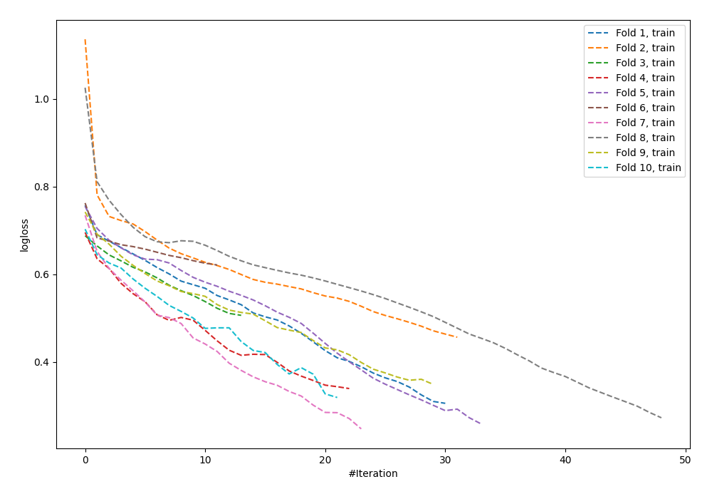

# Summary of 62_NeuralNetwork

[<< Go back](../README.md)

## Neural Network
- **n_jobs**: -1
- **dense_1_size**: 64
- **dense_2_size**: 4
- **learning_rate**: 0.01
- **explain_level**: 0

## Validation
 - **validation_type**: kfold
 - **shuffle**: True
 - **stratify**: True
 - **k_folds**: 10

## Optimized metric
logloss

## Training time

2.6 seconds

## Metric details
|           |    score |   threshold |
|:----------|---------:|------------:|
| logloss   | 0.64587  | nan         |
| auc       | 0.686694 | nan         |
| f1        | 0.721485 |   0.38836   |
| accuracy  | 0.64     |   0.422445  |
| precision | 0.882353 |   0.802037  |
| recall    | 1        |   0.0167101 |
| mcc       | 0.282624 |   0.598323  |

## Confusion matrix (at threshold=0.422445)
|                     |   Predicted as negative |   Predicted as positive |
|:--------------------|------------------------:|------------------------:|
| Labeled as negative |                      50 |                      76 |
| Labeled as positive |                      23 |                     126 |

## Learning curves

[<< Go back](../README.md)
