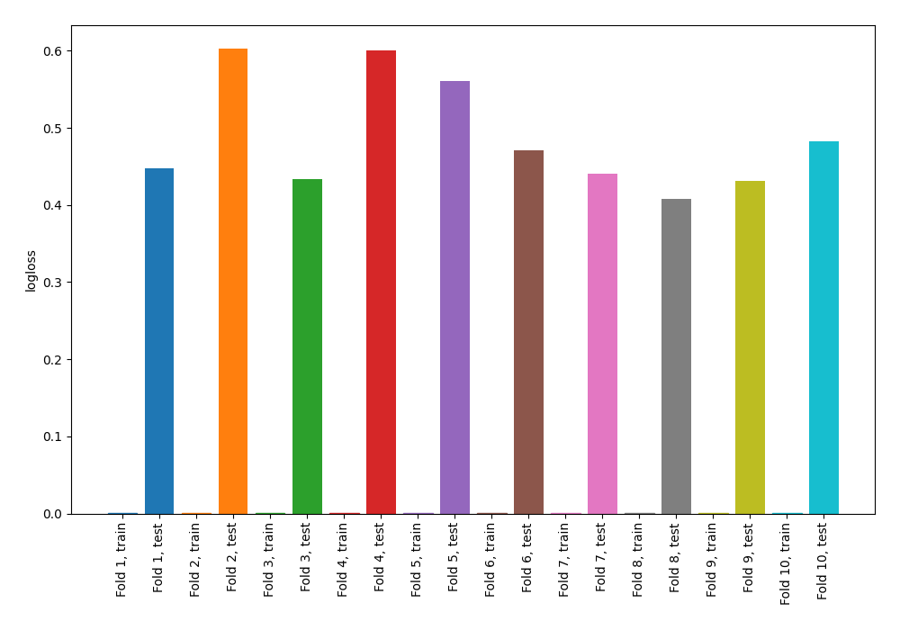

# Summary of 68_NearestNeighbors

[<< Go back](../README.md)

## k-Nearest Neighbors (Nearest Neighbors)
- **n_jobs**: -1
- **n_neighbors**: 7
- **weights**: distance
- **explain_level**: 0

## Validation
 - **validation_type**: kfold
 - **shuffle**: True
 - **stratify**: True
 - **k_folds**: 10

## Optimized metric
logloss

## Training time

0.7 seconds

## Metric details
|           |    score |   threshold |
|:----------|---------:|------------:|
| logloss   | 0.48855  |  nan        |
| auc       | 0.841004 |  nan        |
| f1        | 0.8      |    0.408539 |
| accuracy  | 0.752727 |    0.454497 |
| precision | 0.916667 |    0.826837 |
| recall    | 1        |    0        |
| mcc       | 0.515171 |    0.408539 |

## Confusion matrix (at threshold=0.454497)
|                     |   Predicted as negative |   Predicted as positive |
|:--------------------|------------------------:|------------------------:|
| Labeled as negative |                      87 |                      39 |
| Labeled as positive |                      29 |                     120 |

## Learning curves

[<< Go back](../README.md)
