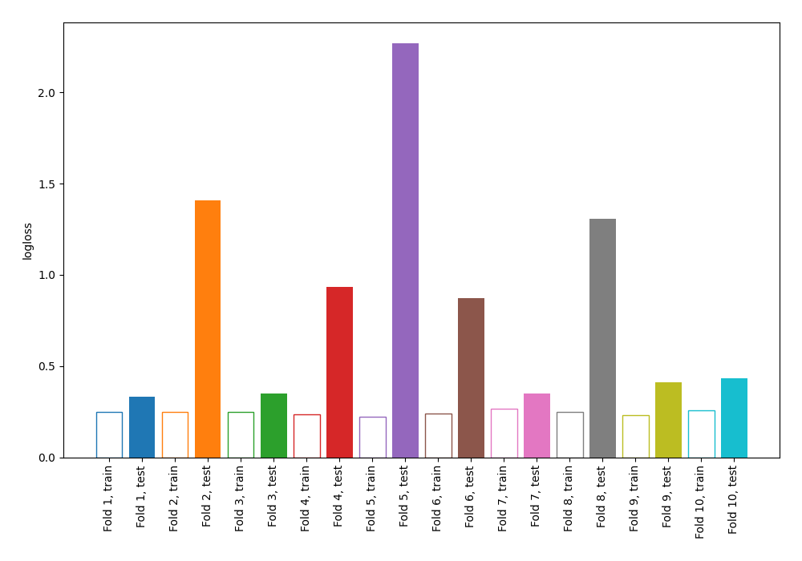

# Summary of 70_NearestNeighbors

[<< Go back](../README.md)

## k-Nearest Neighbors (Nearest Neighbors)
- **n_jobs**: -1
- **n_neighbors**: 3
- **weights**: uniform
- **explain_level**: 0

## Validation
 - **validation_type**: kfold
 - **shuffle**: True
 - **stratify**: True
 - **k_folds**: 10

## Optimized metric
logloss

## Training time

0.6 seconds

## Metric details
|           |    score |   threshold |
|:----------|---------:|------------:|
| logloss   | 0.869975 |  nan        |
| auc       | 0.828699 |  nan        |
| f1        | 0.783784 |    0.333333 |
| accuracy  | 0.767273 |    0.333333 |
| precision | 0.789116 |    0.333333 |
| recall    | 0.979866 |    0        |
| mcc       | 0.531897 |    0.333333 |

## Confusion matrix (at threshold=0.333333)
|                     |   Predicted as negative |   Predicted as positive |
|:--------------------|------------------------:|------------------------:|
| Labeled as negative |                      95 |                      31 |
| Labeled as positive |                      33 |                     116 |

## Learning curves

[<< Go back](../README.md)
