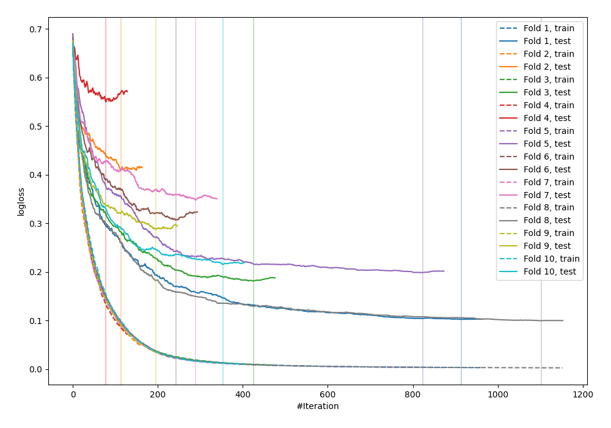

# Summary of 73_CatBoost

[<< Go back](../README.md)

## CatBoost
- **n_jobs**: -1
- **learning_rate**: 0.05
- **depth**: 6
- **rsm**: 0.7
- **loss_function**: Logloss
- **explain_level**: 0

## Validation
 - **validation_type**: kfold
 - **shuffle**: True
 - **stratify**: True
 - **k_folds**: 10

## Optimized metric
logloss

## Training time

13.8 seconds

## Metric details
|           |    score |    threshold |
|:----------|---------:|-------------:|
| logloss   | 0.270409 | nan          |
| auc       | 0.956642 | nan          |
| f1        | 0.900662 |   0.490628   |
| accuracy  | 0.894545 |   0.711092   |
| precision | 1        |   0.960702   |
| recall    | 1        |   0.00164087 |
| mcc       | 0.795859 |   0.711092   |

## Confusion matrix (at threshold=0.711092)
|                     |   Predicted as negative |   Predicted as positive |
|:--------------------|------------------------:|------------------------:|
| Labeled as negative |                     120 |                       6 |
| Labeled as positive |                      23 |                     126 |

## Learning curves

[<< Go back](../README.md)
