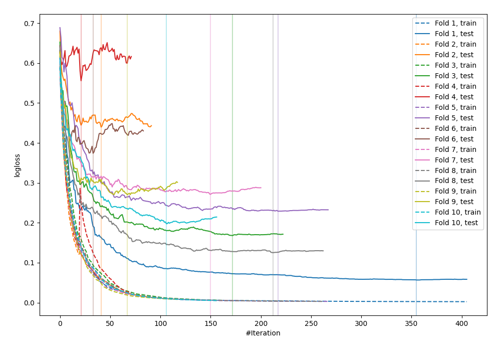

# Summary of 74_CatBoost

[<< Go back](../README.md)

## CatBoost
- **n_jobs**: -1
- **learning_rate**: 0.2
- **depth**: 6
- **rsm**: 0.7
- **loss_function**: Logloss
- **explain_level**: 0

## Validation
 - **validation_type**: kfold
 - **shuffle**: True
 - **stratify**: True
 - **k_folds**: 10

## Optimized metric
logloss

## Training time

5.9 seconds

## Metric details
|           |    score |     threshold |
|:----------|---------:|--------------:|
| logloss   | 0.269212 | nan           |
| auc       | 0.954831 | nan           |
| f1        | 0.899329 |   0.508594    |
| accuracy  | 0.890909 |   0.508594    |
| precision | 1        |   0.980072    |
| recall    | 1        |   0.000492882 |
| mcc       | 0.780634 |   0.54557     |

## Confusion matrix (at threshold=0.508594)
|                     |   Predicted as negative |   Predicted as positive |
|:--------------------|------------------------:|------------------------:|
| Labeled as negative |                     111 |                      15 |
| Labeled as positive |                      15 |                     134 |

## Learning curves

[<< Go back](../README.md)
