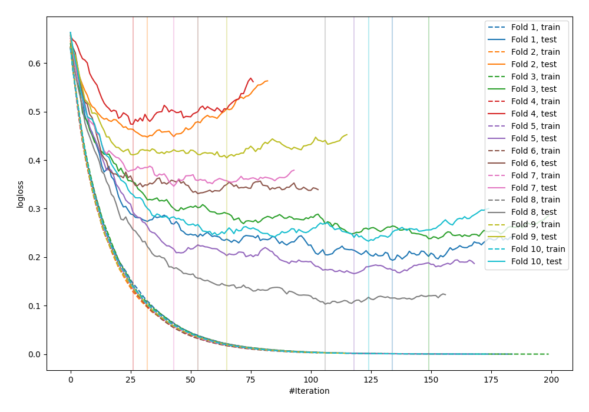

# Summary of 75_LightGBM

[<< Go back](../README.md)

## LightGBM
- **n_jobs**: -1
- **objective**: binary
- **metric**: binary_logloss
- **num_leaves**: 63
- **learning_rate**: 0.1
- **feature_fraction**: 0.5
- **bagging_fraction**: 1.0
- **min_data_in_leaf**: 10
- **explain_level**: 0

## Validation
 - **validation_type**: kfold
 - **shuffle**: True
 - **stratify**: True
 - **k_folds**: 10

## Optimized metric
logloss

## Training time

1.5 seconds

## Metric details
|           |    score |     threshold |
|:----------|---------:|--------------:|
| logloss   | 0.293916 | nan           |
| auc       | 0.947534 | nan           |
| f1        | 0.897436 |   0.354531    |
| accuracy  | 0.883636 |   0.581551    |
| precision | 1        |   0.974279    |
| recall    | 1        |   0.000243781 |
| mcc       | 0.767723 |   0.354531    |

## Confusion matrix (at threshold=0.581551)
|                     |   Predicted as negative |   Predicted as positive |
|:--------------------|------------------------:|------------------------:|
| Labeled as negative |                     112 |                      14 |
| Labeled as positive |                      18 |                     131 |

## Learning curves

[<< Go back](../README.md)
