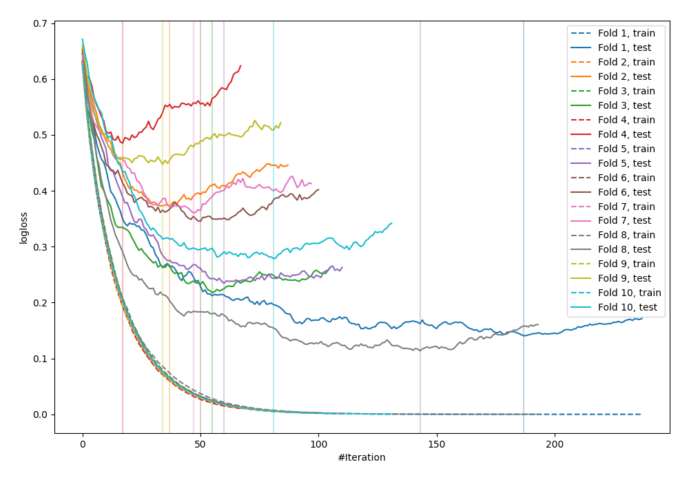

# Summary of 78_LightGBM

[<< Go back](../README.md)

## LightGBM
- **n_jobs**: -1
- **objective**: binary
- **metric**: binary_logloss
- **num_leaves**: 63
- **learning_rate**: 0.1
- **feature_fraction**: 0.9
- **bagging_fraction**: 0.9
- **min_data_in_leaf**: 10
- **explain_level**: 0

## Validation
 - **validation_type**: kfold
 - **shuffle**: True
 - **stratify**: True
 - **k_folds**: 10

## Optimized metric
logloss

## Training time

1.6 seconds

## Metric details
|           |    score |     threshold |
|:----------|---------:|--------------:|
| logloss   | 0.299349 | nan           |
| auc       | 0.942687 | nan           |
| f1        | 0.902597 |   0.433752    |
| accuracy  | 0.890909 |   0.433752    |
| precision | 1        |   0.968745    |
| recall    | 1        |   8.98072e-06 |
| mcc       | 0.781051 |   0.433752    |

## Confusion matrix (at threshold=0.433752)
|                     |   Predicted as negative |   Predicted as positive |
|:--------------------|------------------------:|------------------------:|
| Labeled as negative |                     106 |                      20 |
| Labeled as positive |                      10 |                     139 |

## Learning curves

[<< Go back](../README.md)
