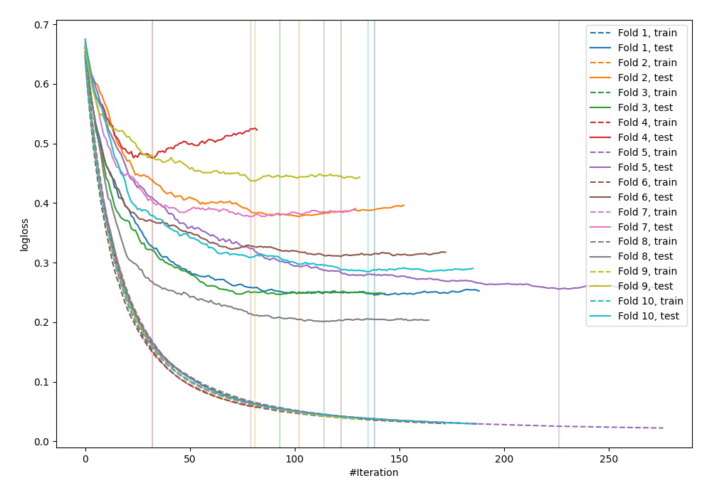

# Summary of 79_Xgboost

[<< Go back](../README.md)

## Extreme Gradient Boosting (Xgboost)
- **n_jobs**: -1
- **objective**: binary:logistic
- **eval_metric**: logloss
- **eta**: 0.075
- **max_depth**: 5
- **min_child_weight**: 1
- **subsample**: 1.0
- **colsample_bytree**: 1.0
- **explain_level**: 0

## Validation
 - **validation_type**: kfold
 - **shuffle**: True
 - **stratify**: True
 - **k_folds**: 10

## Optimized metric
logloss

## Training time

3.4 seconds

## Metric details
|           |    score |    threshold |
|:----------|---------:|-------------:|
| logloss   | 0.321061 | nan          |
| auc       | 0.937094 | nan          |
| f1        | 0.88746  |   0.436506   |
| accuracy  | 0.872727 |   0.455767   |
| precision | 1        |   0.946069   |
| recall    | 1        |   0.00333838 |
| mcc       | 0.745043 |   0.436506   |

## Confusion matrix (at threshold=0.455767)
|                     |   Predicted as negative |   Predicted as positive |
|:--------------------|------------------------:|------------------------:|
| Labeled as negative |                     104 |                      22 |
| Labeled as positive |                      13 |                     136 |

## Learning curves

[<< Go back](../README.md)
