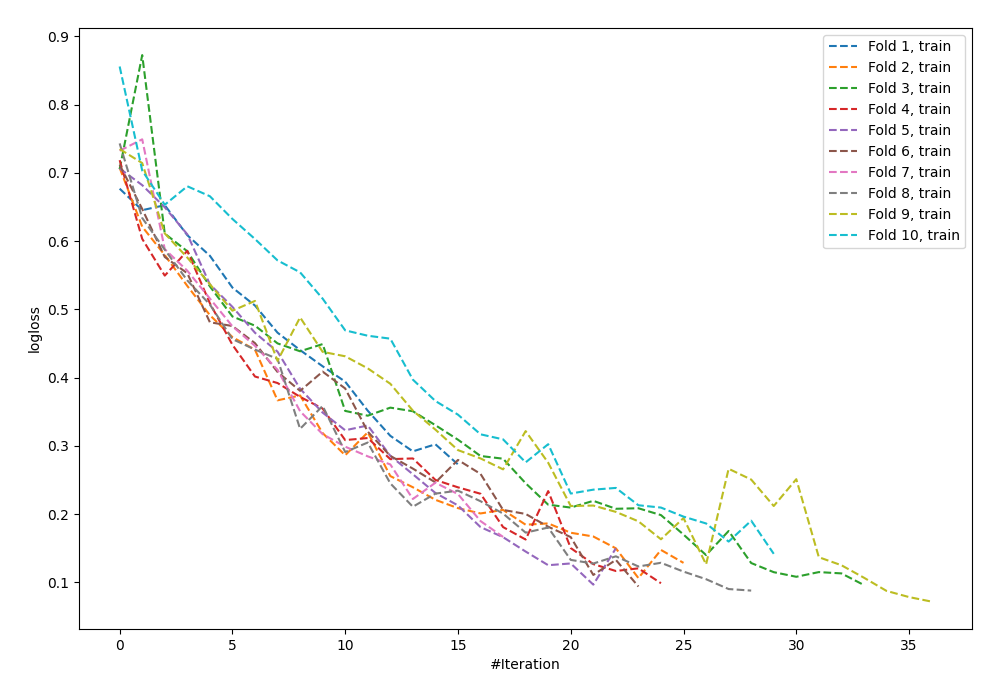

# Summary of 8_Default_NeuralNetwork

[<< Go back](../README.md)

## Neural Network
- **n_jobs**: -1
- **dense_1_size**: 32
- **dense_2_size**: 16
- **learning_rate**: 0.05
- **explain_level**: 0

## Validation
 - **validation_type**: kfold
 - **shuffle**: True
 - **stratify**: True
 - **k_folds**: 10

## Optimized metric
logloss

## Training time

1.3 seconds

## Metric details
|           |    score |     threshold |
|:----------|---------:|--------------:|
| logloss   | 0.718679 | nan           |
| auc       | 0.758016 | nan           |
| f1        | 0.763848 |   0.3678      |
| accuracy  | 0.705455 |   0.3678      |
| precision | 0.958333 |   0.9949      |
| recall    | 1        |   0.000217583 |
| mcc       | 0.414474 |   0.3678      |

## Confusion matrix (at threshold=0.3678)
|                     |   Predicted as negative |   Predicted as positive |
|:--------------------|------------------------:|------------------------:|
| Labeled as negative |                      63 |                      63 |
| Labeled as positive |                      18 |                     131 |

## Learning curves

[<< Go back](../README.md)
