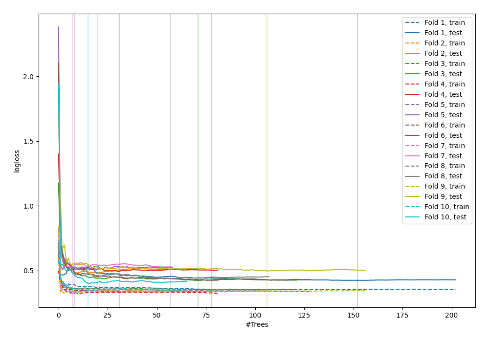

# Summary of 9_Default_RandomForest

[<< Go back](../README.md)

## Random Forest
- **n_jobs**: -1
- **criterion**: gini
- **max_features**: 0.9
- **min_samples_split**: 30
- **max_depth**: 4
- **explain_level**: 0

## Validation
 - **validation_type**: kfold
 - **shuffle**: True
 - **stratify**: True
 - **k_folds**: 10

## Optimized metric
logloss

## Training time

8.8 seconds

## Metric details
|           |    score |   threshold |
|:----------|---------:|------------:|
| logloss   | 0.459268 | nan         |
| auc       | 0.879887 | nan         |
| f1        | 0.827362 |   0.470393  |
| accuracy  | 0.814545 |   0.510084  |
| precision | 1        |   0.876982  |
| recall    | 1        |   0.0553957 |
| mcc       | 0.628893 |   0.510084  |

## Confusion matrix (at threshold=0.510084)
|                     |   Predicted as negative |   Predicted as positive |
|:--------------------|------------------------:|------------------------:|
| Labeled as negative |                     104 |                      22 |
| Labeled as positive |                      29 |                     120 |

## Learning curves

[<< Go back](../README.md)
