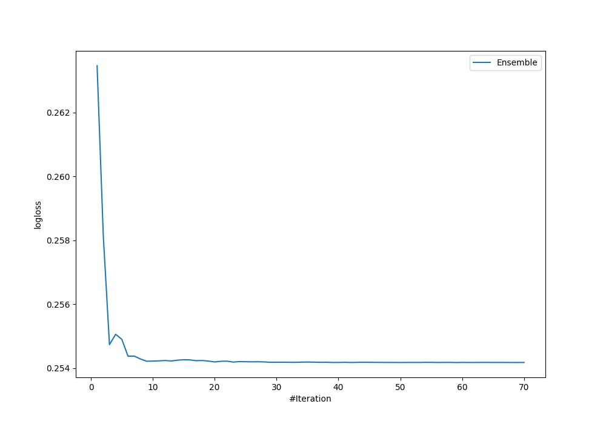

# Summary of Ensemble

[<< Go back](../README.md)

## Ensemble structure
| Model       |   Weight |
|:------------|---------:|
| 31_CatBoost |       13 |
| 33_CatBoost |       21 |
| 72_CatBoost |        1 |
| 74_CatBoost |       18 |
| 77_LightGBM |        6 |

## Metric details
|           |    score |   threshold |
|:----------|---------:|------------:|
| logloss   | 0.254176 | nan         |
| auc       | 0.962235 | nan         |
| f1        | 0.907285 |   0.496806  |
| accuracy  | 0.898182 |   0.507695  |
| precision | 1        |   0.960504  |
| recall    | 1        |   0.0016944 |
| mcc       | 0.800822 |   0.662743  |

## Confusion matrix (at threshold=0.507695)
|                     |   Predicted as negative |   Predicted as positive |
|:--------------------|------------------------:|------------------------:|
| Labeled as negative |                     111 |                      15 |
| Labeled as positive |                      13 |                     136 |

## Learning curves

[<< Go back](../README.md)
