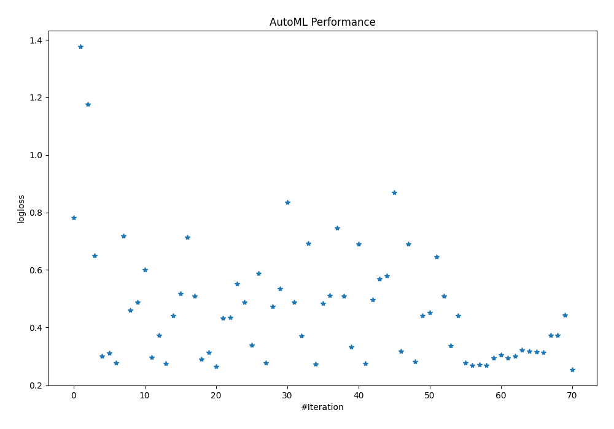

# AutoML Leaderboard

| Best model   | name                                                         | model_type     | metric_type   |   metric_value |   train_time |
|:-------------|:-------------------------------------------------------------|:---------------|:--------------|---------------:|-------------:|
|              | [1_DecisionTree](1_DecisionTree/README.md)                   | Decision Tree  | logloss       |       0.782575 |         1.12 |
|              | [2_DecisionTree](2_DecisionTree/README.md)                   | Decision Tree  | logloss       |       1.37583  |         0.78 |
|              | [3_DecisionTree](3_DecisionTree/README.md)                   | Decision Tree  | logloss       |       1.17593  |         0.77 |
|              | [4_Linear](4_Linear/README.md)                               | Linear         | logloss       |       0.649016 |         3.23 |
|              | [5_Default_LightGBM](5_Default_LightGBM/README.md)           | LightGBM       | logloss       |       0.301268 |         2.44 |
|              | [6_Default_Xgboost](6_Default_Xgboost/README.md)             | Xgboost        | logloss       |       0.310859 |         3.74 |
| **the best** | [7_Default_CatBoost](7_Default_CatBoost/README.md)           | CatBoost       | logloss       |       0.27747  |         8.93 |
|              | [8_Default_NeuralNetwork](8_Default_NeuralNetwork/README.md) | Neural Network | logloss       |       0.718679 |         1.64 |

### AutoML Performance

### AutoML Performance Boxplot
