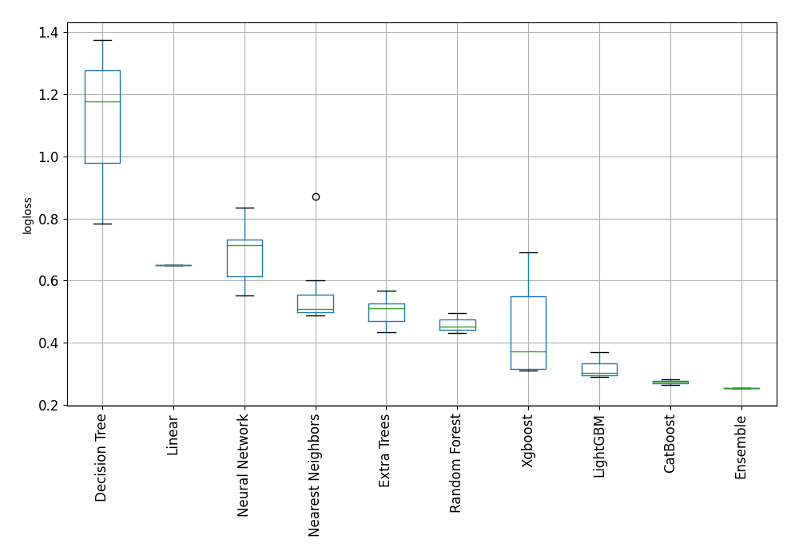

# AutoML Leaderboard

| Best model   | name                                                                 | model_type        | metric_type   |   metric_value |   train_time |
|:-------------|:---------------------------------------------------------------------|:------------------|:--------------|---------------:|-------------:|
|              | [1_DecisionTree](1_DecisionTree/README.md)                           | Decision Tree     | logloss       |       0.782575 |         1.12 |
|              | [2_DecisionTree](2_DecisionTree/README.md)                           | Decision Tree     | logloss       |       1.37583  |         0.78 |
|              | [3_DecisionTree](3_DecisionTree/README.md)                           | Decision Tree     | logloss       |       1.17593  |         0.77 |
|              | [4_Linear](4_Linear/README.md)                                       | Linear            | logloss       |       0.649016 |         3.23 |
|              | [5_Default_LightGBM](5_Default_LightGBM/README.md)                   | LightGBM          | logloss       |       0.301268 |         2.44 |
|              | [6_Default_Xgboost](6_Default_Xgboost/README.md)                     | Xgboost           | logloss       |       0.310859 |         3.74 |
|              | [7_Default_CatBoost](7_Default_CatBoost/README.md)                   | CatBoost          | logloss       |       0.27747  |         8.93 |
|              | [8_Default_NeuralNetwork](8_Default_NeuralNetwork/README.md)         | Neural Network    | logloss       |       0.718679 |         1.64 |
|              | [9_Default_RandomForest](9_Default_RandomForest/README.md)           | Random Forest     | logloss       |       0.459268 |         9.28 |
|              | [10_Default_ExtraTrees](10_Default_ExtraTrees/README.md)             | Extra Trees       | logloss       |       0.488188 |         5.78 |
|              | [11_Default_NearestNeighbors](11_Default_NearestNeighbors/README.md) | Nearest Neighbors | logloss       |       0.601604 |         1    |
|              | [21_LightGBM](21_LightGBM/README.md)                                 | LightGBM          | logloss       |       0.296782 |         2    |
|              | [12_Xgboost](12_Xgboost/README.md)                                   | Xgboost           | logloss       |       0.371756 |         4.44 |
|              | [30_CatBoost](30_CatBoost/README.md)                                 | CatBoost          | logloss       |       0.274779 |        36.83 |
|              | [39_RandomForest](39_RandomForest/README.md)                         | Random Forest     | logloss       |       0.441948 |         7.21 |
|              | [48_ExtraTrees](48_ExtraTrees/README.md)                             | Extra Trees       | logloss       |       0.517509 |         6.06 |
|              | [57_NeuralNetwork](57_NeuralNetwork/README.md)                       | Neural Network    | logloss       |       0.713123 |         1.59 |
|              | [66_NearestNeighbors](66_NearestNeighbors/README.md)                 | Nearest Neighbors | logloss       |       0.508355 |         1.03 |
|              | [22_LightGBM](22_LightGBM/README.md)                                 | LightGBM          | logloss       |       0.29011  |         1.64 |
|              | [13_Xgboost](13_Xgboost/README.md)                                   | Xgboost           | logloss       |       0.313866 |         3.71 |
|              | [31_CatBoost](31_CatBoost/README.md)                                 | CatBoost          | logloss       |       0.263467 |        42.28 |
|              | [40_RandomForest](40_RandomForest/README.md)                         | Random Forest     | logloss       |       0.43197  |         7.3  |
|              | [49_ExtraTrees](49_ExtraTrees/README.md)                             | Extra Trees       | logloss       |       0.434427 |         5.23 |
|              | [58_NeuralNetwork](58_NeuralNetwork/README.md)                       | Neural Network    | logloss       |       0.551554 |         3.07 |
|              | [67_NearestNeighbors](67_NearestNeighbors/README.md)                 | Nearest Neighbors | logloss       |       0.48855  |         0.96 |
|              | [23_LightGBM](23_LightGBM/README.md)                                 | LightGBM          | logloss       |       0.339662 |         1.67 |
|              | [14_Xgboost](14_Xgboost/README.md)                                   | Xgboost           | logloss       |       0.587233 |         2.29 |
|              | [32_CatBoost](32_CatBoost/README.md)                                 | CatBoost          | logloss       |       0.276639 |        16.59 |
|              | [41_RandomForest](41_RandomForest/README.md)                         | Random Forest     | logloss       |       0.473459 |         6.02 |
|              | [50_ExtraTrees](50_ExtraTrees/README.md)                             | Extra Trees       | logloss       |       0.533758 |         5.15 |
|              | [59_NeuralNetwork](59_NeuralNetwork/README.md)                       | Neural Network    | logloss       |       0.83599  |         2.92 |
|              | [68_NearestNeighbors](68_NearestNeighbors/README.md)                 | Nearest Neighbors | logloss       |       0.48855  |         0.93 |
|              | [24_LightGBM](24_LightGBM/README.md)                                 | LightGBM          | logloss       |       0.370315 |         1.69 |
|              | [15_Xgboost](15_Xgboost/README.md)                                   | Xgboost           | logloss       |       0.691872 |        18.43 |
|              | [33_CatBoost](33_CatBoost/README.md)                                 | CatBoost          | logloss       |       0.272841 |        19.81 |
|              | [42_RandomForest](42_RandomForest/README.md)                         | Random Forest     | logloss       |       0.484128 |         6.45 |
|              | [51_ExtraTrees](51_ExtraTrees/README.md)                             | Extra Trees       | logloss       |       0.511953 |         5.6  |
|              | [60_NeuralNetwork](60_NeuralNetwork/README.md)                       | Neural Network    | logloss       |       0.745245 |         1.74 |
|              | [69_NearestNeighbors](69_NearestNeighbors/README.md)                 | Nearest Neighbors | logloss       |       0.508355 |         1.01 |
|              | [25_LightGBM](25_LightGBM/README.md)                                 | LightGBM          | logloss       |       0.331209 |         1.65 |
|              | [16_Xgboost](16_Xgboost/README.md)                                   | Xgboost           | logloss       |       0.689446 |         1.59 |
|              | [34_CatBoost](34_CatBoost/README.md)                                 | CatBoost          | logloss       |       0.273692 |         9.17 |
|              | [43_RandomForest](43_RandomForest/README.md)                         | Random Forest     | logloss       |       0.496474 |         5.87 |
|              | [52_ExtraTrees](52_ExtraTrees/README.md)                             | Extra Trees       | logloss       |       0.567995 |         5.72 |
|              | [61_NeuralNetwork](61_NeuralNetwork/README.md)                       | Neural Network    | logloss       |       0.57973  |         2.78 |
|              | [70_NearestNeighbors](70_NearestNeighbors/README.md)                 | Nearest Neighbors | logloss       |       0.869975 |         1.4  |
|              | [26_LightGBM](26_LightGBM/README.md)                                 | LightGBM          | logloss       |       0.317197 |         2.62 |
|              | [17_Xgboost](17_Xgboost/README.md)                                   | Xgboost           | logloss       |       0.689361 |         1.58 |
|              | [35_CatBoost](35_CatBoost/README.md)                                 | CatBoost          | logloss       |       0.281628 |         5.07 |
|              | [44_RandomForest](44_RandomForest/README.md)                         | Random Forest     | logloss       |       0.441874 |         6.31 |
|              | [53_ExtraTrees](53_ExtraTrees/README.md)                             | Extra Trees       | logloss       |       0.451589 |         5.88 |
|              | [62_NeuralNetwork](62_NeuralNetwork/README.md)                       | Neural Network    | logloss       |       0.64587  |         2.88 |
|              | [71_NearestNeighbors](71_NearestNeighbors/README.md)                 | Nearest Neighbors | logloss       |       0.508355 |         0.91 |
|              | [27_LightGBM](27_LightGBM/README.md)                                 | LightGBM          | logloss       |       0.336935 |         2.07 |
|              | [18_Xgboost](18_Xgboost/README.md)                                   | Xgboost           | logloss       |       0.43995  |         2.43 |
|              | [36_CatBoost](36_CatBoost/README.md)                                 | CatBoost          | logloss       |       0.276533 |        78.92 |
|              | [72_CatBoost](72_CatBoost/README.md)                                 | CatBoost          | logloss       |       0.268122 |        40.82 |
|              | [73_CatBoost](73_CatBoost/README.md)                                 | CatBoost          | logloss       |       0.270409 |        14.38 |
|              | [74_CatBoost](74_CatBoost/README.md)                                 | CatBoost          | logloss       |       0.269212 |         6.49 |
|              | [75_LightGBM](75_LightGBM/README.md)                                 | LightGBM          | logloss       |       0.293916 |         2.06 |
|              | [76_LightGBM](76_LightGBM/README.md)                                 | LightGBM          | logloss       |       0.304111 |         2.23 |
|              | [77_LightGBM](77_LightGBM/README.md)                                 | LightGBM          | logloss       |       0.293316 |         1.67 |
|              | [78_LightGBM](78_LightGBM/README.md)                                 | LightGBM          | logloss       |       0.299349 |         2.16 |
|              | [79_Xgboost](79_Xgboost/README.md)                                   | Xgboost           | logloss       |       0.321061 |         3.9  |
|              | [80_Xgboost](80_Xgboost/README.md)                                   | Xgboost           | logloss       |       0.317229 |         4.27 |
|              | [81_Xgboost](81_Xgboost/README.md)                                   | Xgboost           | logloss       |       0.31478  |         3.77 |
|              | [82_Xgboost](82_Xgboost/README.md)                                   | Xgboost           | logloss       |       0.313866 |         3.55 |
|              | [83_Xgboost](83_Xgboost/README.md)                                   | Xgboost           | logloss       |       0.371756 |         4.19 |
|              | [84_Xgboost](84_Xgboost/README.md)                                   | Xgboost           | logloss       |       0.371756 |         4.13 |
|              | [85_RandomForest](85_RandomForest/README.md)                         | Random Forest     | logloss       |       0.442058 |         7.89 |
| **the best** | [Ensemble](Ensemble/README.md)                                       | Ensemble          | logloss       |       0.254176 |        20.77 |

### AutoML Performance

### AutoML Performance Boxplot
