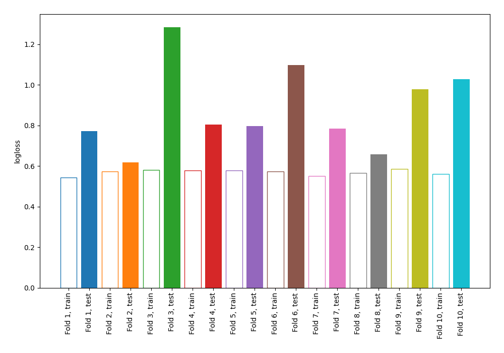

# Summary of 3_DecisionTree

[<< Go back](../README.md)

## Decision Tree
- **n_jobs**: -1
- **criterion**: gini
- **max_depth**: 4
- **explain_level**: 0

## Validation
 - **validation_type**: kfold
 - **shuffle**: True
 - **stratify**: True
 - **k_folds**: 10

## Optimized metric
logloss

## Training time

0.9 seconds

## Metric details
|           |    score |   threshold |
|:----------|---------:|------------:|
| logloss   | 0.880997 |  nan        |
| auc       | 0.631088 |  nan        |
| f1        | 0.677467 |    0.135135 |
| accuracy  | 0.598698 |    0.553581 |
| precision | 0.833333 |    0.945195 |
| recall    | 0.983051 |    0        |
| mcc       | 0.211994 |    0.593641 |

## Confusion matrix (at threshold=0.553581)
|                     |   Predicted as negative |   Predicted as positive |
|:--------------------|------------------------:|------------------------:|
| Labeled as negative |                     313 |                     137 |
| Labeled as positive |                     233 |                     239 |

## Learning curves

[<< Go back](../README.md)
