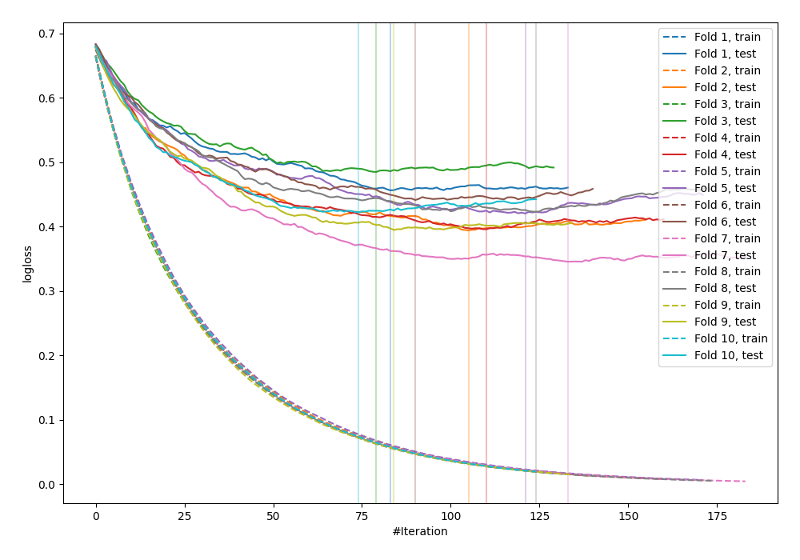

# Summary of 5_Default_LightGBM

[<< Go back](../README.md)

## LightGBM
- **n_jobs**: -1
- **objective**: binary
- **metric**: binary_logloss
- **num_leaves**: 63
- **learning_rate**: 0.05
- **feature_fraction**: 0.9
- **bagging_fraction**: 0.9
- **min_data_in_leaf**: 10
- **explain_level**: 0

## Validation
 - **validation_type**: kfold
 - **shuffle**: True
 - **stratify**: True
 - **k_folds**: 10

## Optimized metric
logloss

## Training time

5.7 seconds

## Metric details
|           |    score |    threshold |
|:----------|---------:|-------------:|
| logloss   | 0.417879 | nan          |
| auc       | 0.888757 | nan          |
| f1        | 0.827653 |   0.364128   |
| accuracy  | 0.812364 |   0.5703     |
| precision | 1        |   0.980713   |
| recall    | 1        |   0.00260921 |
| mcc       | 0.627    |   0.5703     |

## Confusion matrix (at threshold=0.5703)
|                     |   Predicted as negative |   Predicted as positive |
|:--------------------|------------------------:|------------------------:|
| Labeled as negative |                     381 |                      69 |
| Labeled as positive |                     104 |                     368 |

## Learning curves

[<< Go back](../README.md)
