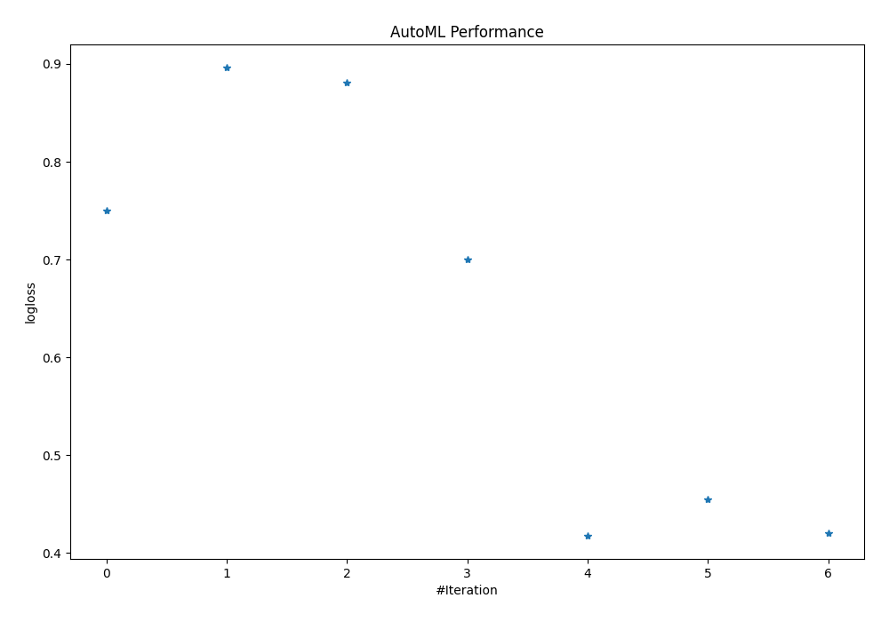
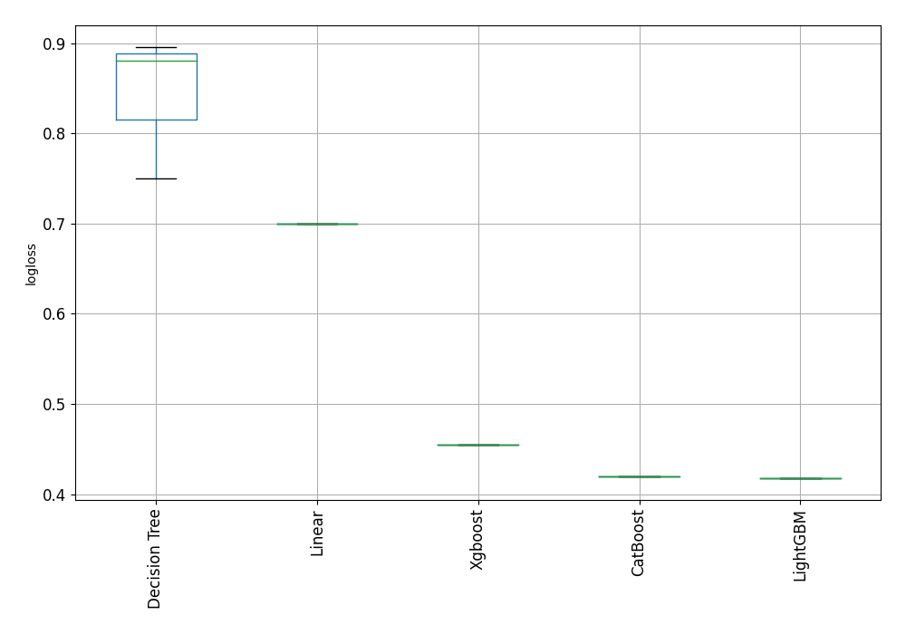

# AutoML Leaderboard

| Best model   | name                                               | model_type    | metric_type   |   metric_value |   train_time |
|:-------------|:---------------------------------------------------|:--------------|:--------------|---------------:|-------------:|
|              | [1_DecisionTree](1_DecisionTree/README.md)         | Decision Tree | logloss       |       0.74979  |         1.33 |
|              | [2_DecisionTree](2_DecisionTree/README.md)         | Decision Tree | logloss       |       0.895981 |         1.17 |
|              | [3_DecisionTree](3_DecisionTree/README.md)         | Decision Tree | logloss       |       0.880997 |         1.18 |
|              | [4_Linear](4_Linear/README.md)                     | Linear        | logloss       |       0.699841 |         4.05 |
| **the best** | [5_Default_LightGBM](5_Default_LightGBM/README.md) | LightGBM      | logloss       |       0.417879 |         6.31 |
|              | [6_Default_Xgboost](6_Default_Xgboost/README.md)   | Xgboost       | logloss       |       0.454812 |         8.78 |
|              | [7_Default_CatBoost](7_Default_CatBoost/README.md) | CatBoost      | logloss       |       0.41995  |        13.7  |

### AutoML Performance

### AutoML Performance Boxplot
